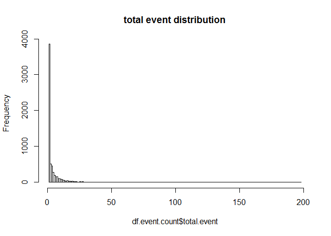

Introduction
------------

SensorsData.cn is a Chinse website that provides user behavior analysis
for customers. Here, I am going to clean the website log data for
SensorsData and analyze user activities on this website. My goal is to
discover interesting pattern and propose business insights to improve
user application. This document is the second part, containing data
transformation, feature selection and engineering.

Load libraries
--------------

    library(dplyr)
    library(reshape)

Read cleaned data
-----------------

    df.cleaned <- read.csv("sensors_user_info_complete.csv", stringsAsFactors = FALSE)
    dim(df.cleaned)

    ## [1] 30723    70

Data Exploration
----------------

    # number of unique id
    length(unique(df.cleaned$distinct_id)) #6452

    ## [1] 6452

    # time span of data
    range(df.cleaned$time) # 6 days time span

    ## [1] "2017-03-06 01:04:10" "2017-03-12 04:58:30"

    # unique events
    events <- unique(df.cleaned$event) # 12 events
    events

    ##  [1] "$pageview"             "btnClick"             
    ##  [3] "click_send_cellphone"  "verify_cellphone_code"
    ##  [5] "index_leave"           "clickSubmit"          
    ##  [7] "demo_leave"            "about_leave"          
    ##  [9] "courses_leave"         "formSubmit"           
    ## [11] "page_close"            "courses_play_leave"

    # number of new users 
    new.users <- df.cleaned %>%
                    distinct(distinct_id) # return data frame
    dim(new.users)[1] #6452 users

    ## [1] 6452

Create a separate dataset for each event for easy exploration
-------------------------------------------------------------

    events <- unique(df.cleaned$event)
    events

    ##  [1] "$pageview"             "btnClick"             
    ##  [3] "click_send_cellphone"  "verify_cellphone_code"
    ##  [5] "index_leave"           "clickSubmit"          
    ##  [7] "demo_leave"            "about_leave"          
    ##  [9] "courses_leave"         "formSubmit"           
    ## [11] "page_close"            "courses_play_leave"

    for (i in events){
      df.sub <- subset(df.cleaned, event == i)
      if (i == "$pageview"){
        i <- "pageview"
      }
      dfname <- paste0("df.", i)
      assign(dfname, df.sub)
    }

Clean dataset. Count the number of each event for each user
-----------------------------------------------------------

    # each event 
    df.event.count <- df.cleaned %>%
      group_by(distinct_id, event) %>%
      summarise(num_event = n()) %>%
      cast(distinct_id ~ event)

    df.event.count <- subset(df.event.count, select = -c(click_send_cellphone, clickSubmit, formSubmit, verify_cellphone_code))
    # in later analysis, I found that click_send_cellphone, verify_cellphone_code, formSubmit and clickSubmit are directly related to user conversion. Exclude these features to uncover other useful information on user conversion

    # total event number
    df.event.count$total.event <- rowSums(df.event.count[2:9], na.rm = TRUE)

    dim(df.event.count)

    ## [1] 6452   10

    # look at distribution
    range(df.event.count$total.event)

    ## [1]   1 198

    hist(df.event.count$total.event, breaks = 198, main = "total event distribution")

Find the first visit time, last visit time and the difference. Ignore the time spent on the last visit page
-----------------------------------------------------------------------------------------------------------

    # first visit time
    df.first.time.stamp <- df.cleaned %>%
      group_by(distinct_id) %>%
      summarise(first.visit.time = min(time))

    # last visit time
    df.last.time.stamp <- df.cleaned %>%
      group_by(distinct_id) %>%
      summarise(last.visit.time = max(time))

    df.visit.time <- merge(df.first.time.stamp, df.last.time.stamp, by = "distinct_id", all = TRUE)

    df.visit.time <- df.visit.time %>%
      mutate(time.span = difftime(last.visit.time, first.visit.time))

    # grow final df by adding useful features
    final.df <- merge(df.visit.time, df.event.count, by = "distinct_id")

Find out the os, model, browser, etc for each user on their first visit
-----------------------------------------------------------------------

    df.os <- subset(df.cleaned, properties..is_first_time == TRUE)

    select.features <- c("distinct_id", "properties..os", "properties..model", "properties..screen_height", "properties..screen_width", "properties..browser", "properties..latest_referrer_host")

    df.os <- df.os[, select.features]

    # add to final df
    final.df <- merge(final.df, df.os, by = "distinct_id")

Event 1. Pageview: find out how many times a user viewed a page
---------------------------------------------------------------

    dim(df.pageview)

    ## [1] 14713    70

    unique(df.pageview$properties..url_path) # 139 urls

    ##   [1] "/"                                                                                                                                                                                                                
    ##   [2] "/manual/kafka_consume.html"                                                                                                                                                                                       
    ##   [3] "/demo.html"                                                                                                                                                                                                       
    ##   [4] "/index.html"                                                                                                                                                                                                      
    ##   [5] "/manual/index.html"                                                                                                                                                                                               
    ##   [6] "/manual/event_ana.html"                                                                                                                                                                                           
    ##   [7] "/product.html"                                                                                                                                                                                                    
    ##   [8] "/manual/"                                                                                                                                                                                                         
    ##   [9] "/b-round.html"                                                                                                                                                                                                    
    ##  [10] "/about.html"                                                                                                                                                                                                      
    ##  [11] "/manual/vtrack_intro.html"                                                                                                                                                                                        
    ##  [12] "/tools/code_auto/"                                                                                                                                                                                                
    ##  [13] "/courses/index.html"                                                                                                                                                                                              
    ##  [14] "/courses/"                                                                                                                                                                                                        
    ##  [15] "/manual/edu_case.html"                                                                                                                                                                                            
    ##  [16] "/manual/edu_case_data_feed.html"                                                                                                                                                                                  
    ##  [17] "/manual/eb_case_core_measure.html"                                                                                                                                                                                
    ##  [18] "/manual/use_steps.html"                                                                                                                                                                                           
    ##  [19] "/courses/play.html"                                                                                                                                                                                               
    ##  [20] "/manual/user_segmentation.html"                                                                                                                                                                                   
    ##  [21] "/manual/data_model.html"                                                                                                                                                                                          
    ##  [22] "/manual/data_schema.html"                                                                                                                                                                                         
    ##  [23] "/manual/js_sdk.html"                                                                                                                                                                                              
    ##  [24] "/tools/url_create.html"                                                                                                                                                                                           
    ##  [25] "/manual/php_sdk.html"                                                                                                                                                                                             
    ##  [26] "/manual/time_on_page.html"                                                                                                                                                                                        
    ##  [27] "/manual/ios_sdk.html"                                                                                                                                                                                             
    ##  [28] "/manual/node_sdk.html"                                                                                                                                                                                            
    ##  [29] "/share/share.html"                                                                                                                                                                                                
    ##  [30] "/manual/user_behavior.html"                                                                                                                                                                                       
    ##  [31] "/manual/retention.html"                                                                                                                                                                                           
    ##  [32] "/manual/user_access_path_ana.html"                                                                                                                                                                                
    ##  [33] "/manual/access_control.html"                                                                                                                                                                                      
    ##  [34] "/manual/data_management.html"                                                                                                                                                                                     
    ##  [35] "/manual/app_h5.html"                                                                                                                                                                                              
    ##  [36] "/manual/addiction.html"                                                                                                                                                                                           
    ##  [37] "/manual/b2b_homepage_case_core_measure.html"                                                                                                                                                                      
    ##  [38] "/manual/data_import_https.html"                                                                                                                                                                                   
    ##  [39] "/manual/query.html"                                                                                                                                                                                               
    ##  [40] "/manual/data_import.html"                                                                                                                                                                                         
    ##  [41] "/manual/api.html"                                                                                                                                                                                                 
    ##  [42] "/manual/java_sdk.html"                                                                                                                                                                                            
    ##  [43] "/manual/user_identify.html"                                                                                                                                                                                       
    ##  [44] "/manual/js_sdk_demo.html"                                                                                                                                                                                         
    ##  [45] "/manual/query_api.html"                                                                                                                                                                                           
    ##  [46] "/manual/android_sdk.html"                                                                                                                                                                                         
    ##  [47] "/manual/eb_case.html"                                                                                                                                                                                             
    ##  [48] "/share/sa_recommend.html"                                                                                                                                                                                         
    ##  [49] "/manual/data_stream.html"                                                                                                                                                                                         
    ##  [50] "/manual/app_channel_tracking.html"                                                                                                                                                                                
    ##  [51] "/manual/web_channel_tracking.html"                                                                                                                                                                                
    ##  [52] "/manual/funnel.html"                                                                                                                                                                                              
    ##  [53] "/manual/about.html"                                                                                                                                                                                               
    ##  [54] "/manual/changelog.html"                                                                                                                                                                                           
    ##  [55] "/manual/use_guide.html"                                                                                                                                                                                           
    ##  [56] "/manual/multi_project.html"                                                                                                                                                                                       
    ##  [57] "/manual/user_ana.html"                                                                                                                                                                                            
    ##  [58] "/manual/python_sdk.html"                                                                                                                                                                                          
    ##  [59] "/manual/b2b_homepage_case.html"                                                                                                                                                                                   
    ##  [60] "/manual/sensors_analytics_term.html"                                                                                                                                                                              
    ##  [61] "/manual/debug_mode.html"                                                                                                                                                                                          
    ##  [62] "/manual/data_import_faq.html"                                                                                                                                                                                     
    ##  [63] "/manual/sa_clean.html"                                                                                                                                                                                            
    ##  [64] "/manual/b2b_homepage_case_data_feed.html"                                                                                                                                                                         
    ##  [65] "/manual/dimension_dict.html"                                                                                                                                                                                      
    ##  [66] "/manual/use_feature_video.html"                                                                                                                                                                                   
    ##  [67] "/manual/sa_share.html"                                                                                                                                                                                            
    ##  [68] "/manual/track_manager.html"                                                                                                                                                                                       
    ##  [69] "/manual/hdfs_importer.html"                                                                                                                                                                                       
    ##  [70] "/manual/project_tools.html"                                                                                                                                                                                       
    ##  [71] "/manual/sdk_manual.html"                                                                                                                                                                                          
    ##  [72] "/manual/apicloud_sdk.html"                                                                                                                                                                                        
    ##  [73] "/manual/batch_importer.html"                                                                                                                                                                                      
    ##  [74] "/manual/track_installation.html"                                                                                                                                                                                  
    ##  [75] "/manual/case.html"                                                                                                                                                                                                
    ##  [76] "/manual/eb_case_data_feed.html"                                                                                                                                                                                   
    ##  [77] "/manual/ext_processor.html"                                                                                                                                                                                       
    ##  [78] "/manual/bookmark_dashboard.html"                                                                                                                                                                                  
    ##  [79] "/manual/func_api.html"                                                                                                                                                                                            
    ##  [80] "/manual/format_importer.html"                                                                                                                                                                                     
    ##  [81] "/D:/x-certificate!/Sensors%20Analytics%20%E4%BD%BF%E7%94%A8%E6%89%8B%E5%86%8C/Sensors%20Analytics%20%E4%BD%BF%E7%94%A8%E6%89%8B%E5%86%8C/index.htm"                                                               
    ##  [82] "/D:/x-certificate!/Sensors%20Analytics%20%E4%BD%BF%E7%94%A8%E6%89%8B%E5%86%8C/Sensors%20Analytics%20%E4%BD%BF%E7%94%A8%E6%89%8B%E5%86%8C/use_steps.html"                                                          
    ##  [83] "/D:/x-certificate!/Sensors%20Analytics%20%E4%BD%BF%E7%94%A8%E6%89%8B%E5%86%8C/Sensors%20Analytics%20%E4%BD%BF%E7%94%A8%E6%89%8B%E5%86%8C/use_guide.html"                                                          
    ##  [84] "/D:/x-certificate!/Sensors%20Analytics%20%E4%BD%BF%E7%94%A8%E6%89%8B%E5%86%8C/Sensors%20Analytics%20%E4%BD%BF%E7%94%A8%E6%89%8B%E5%86%8C/event_ana.html"                                                          
    ##  [85] "/D:/x-certificate!/Sensors%20Analytics%20%E4%BD%BF%E7%94%A8%E6%89%8B%E5%86%8C/Sensors%20Analytics%20%E4%BD%BF%E7%94%A8%E6%89%8B%E5%86%8C/query.html"                                                              
    ##  [86] "/D:/x-certificate!/Sensors%20Analytics%20%E4%BD%BF%E7%94%A8%E6%89%8B%E5%86%8C/Sensors%20Analytics%20%E4%BD%BF%E7%94%A8%E6%89%8B%E5%86%8C/accessories.html"                                                        
    ##  [87] "/D:/x-certificate!/Sensors%20Analytics%20%E4%BD%BF%E7%94%A8%E6%89%8B%E5%86%8C/Sensors%20Analytics%20%E4%BD%BF%E7%94%A8%E6%89%8B%E5%86%8C/about.html"                                                              
    ##  [88] "/D:/x-certificate!/Sensors%20Analytics%20%E4%BD%BF%E7%94%A8%E6%89%8B%E5%86%8C/Sensors%20Analytics%20%E4%BD%BF%E7%94%A8%E6%89%8B%E5%86%8C/batch_importer.html"                                                     
    ##  [89] "/D:/x-certificate!/Sensors%20Analytics%20%E4%BD%BF%E7%94%A8%E6%89%8B%E5%86%8C/Sensors%20Analytics%20%E4%BD%BF%E7%94%A8%E6%89%8B%E5%86%8C/import_tool.html"                                                        
    ##  [90] "/D:/x-certificate!/Sensors%20Analytics%20%E4%BD%BF%E7%94%A8%E6%89%8B%E5%86%8C/Sensors%20Analytics%20%E4%BD%BF%E7%94%A8%E6%89%8B%E5%86%8C/vtrack_intro.html"                                                       
    ##  [91] "/D:/x-certificate!/Sensors%20Analytics%20%E4%BD%BF%E7%94%A8%E6%89%8B%E5%86%8C/Sensors%20Analytics%20%E4%BD%BF%E7%94%A8%E6%89%8B%E5%86%8C/ios_sdk_autotrack.html"                                                  
    ##  [92] "/D:/x-certificate!/Sensors%20Analytics%20%E4%BD%BF%E7%94%A8%E6%89%8B%E5%86%8C/Sensors%20Analytics%20%E4%BD%BF%E7%94%A8%E6%89%8B%E5%86%8C/ios_sdk_faq.html"                                                        
    ##  [93] "/D:/x-certificate!/Sensors%20Analytics%20%E4%BD%BF%E7%94%A8%E6%89%8B%E5%86%8C/Sensors%20Analytics%20%E4%BD%BF%E7%94%A8%E6%89%8B%E5%86%8C/ios_sdk.html"                                                            
    ##  [94] "/D:/x-certificate!/Sensors%20Analytics%20%E4%BD%BF%E7%94%A8%E6%89%8B%E5%86%8C/Sensors%20Analytics%20%E4%BD%BF%E7%94%A8%E6%89%8B%E5%86%8C/android_sdk_autotrack.html"                                              
    ##  [95] "/D:/x-certificate!/Sensors%20Analytics%20%E4%BD%BF%E7%94%A8%E6%89%8B%E5%86%8C/Sensors%20Analytics%20%E4%BD%BF%E7%94%A8%E6%89%8B%E5%86%8C/android_sdk_faq.html"                                                    
    ##  [96] "/D:/x-certificate!/Sensors%20Analytics%20%E4%BD%BF%E7%94%A8%E6%89%8B%E5%86%8C/Sensors%20Analytics%20%E4%BD%BF%E7%94%A8%E6%89%8B%E5%86%8C/android_sdk.html"                                                        
    ##  [97] "/D:/x-certificate!/Sensors%20Analytics%20%E4%BD%BF%E7%94%A8%E6%89%8B%E5%86%8C/Sensors%20Analytics%20%E4%BD%BF%E7%94%A8%E6%89%8B%E5%86%8C/apicloud_sdk.html"                                                       
    ##  [98] "/D:/x-certificate!/Sensors%20Analytics%20%E4%BD%BF%E7%94%A8%E6%89%8B%E5%86%8C/Sensors%20Analytics%20%E4%BD%BF%E7%94%A8%E6%89%8B%E5%86%8C/node_sdk.html"                                                           
    ##  [99] "/D:/x-certificate!/Sensors%20Analytics%20%E4%BD%BF%E7%94%A8%E6%89%8B%E5%86%8C/Sensors%20Analytics%20%E4%BD%BF%E7%94%A8%E6%89%8B%E5%86%8C/mp_sdk.html"                                                             
    ## [100] "/D:/x-certificate!/Sensors%20Analytics%20%E4%BD%BF%E7%94%A8%E6%89%8B%E5%86%8C/Sensors%20Analytics%20%E4%BD%BF%E7%94%A8%E6%89%8B%E5%86%8C/js_sdk_demo.html"                                                        
    ## [101] "/D:/x-certificate!/Sensors%20Analytics%20%E4%BD%BF%E7%94%A8%E6%89%8B%E5%86%8C/Sensors%20Analytics%20%E4%BD%BF%E7%94%A8%E6%89%8B%E5%86%8C/data_import.html"                                                        
    ## [102] "/D:/x-certificate!/Sensors%20Analytics%20%E4%BD%BF%E7%94%A8%E6%89%8B%E5%86%8C/Sensors%20Analytics%20%E4%BD%BF%E7%94%A8%E6%89%8B%E5%86%8C/web_analytics_term.html"                                                 
    ## [103] "/D:/x-certificate!/Sensors%20Analytics%20%E4%BD%BF%E7%94%A8%E6%89%8B%E5%86%8C/Sensors%20Analytics%20%E4%BD%BF%E7%94%A8%E6%89%8B%E5%86%8C/web_channel_tracking.html"                                               
    ## [104] "/D:/x-certificate!/Sensors%20Analytics%20%E4%BD%BF%E7%94%A8%E6%89%8B%E5%86%8C/Sensors%20Analytics%20%E4%BD%BF%E7%94%A8%E6%89%8B%E5%86%8C/user_identify.html"                                                      
    ## [105] "/D:/x-certificate!/Sensors%20Analytics%20%E4%BD%BF%E7%94%A8%E6%89%8B%E5%86%8C/Sensors%20Analytics%20%E4%BD%BF%E7%94%A8%E6%89%8B%E5%86%8C/addiction.html"                                                          
    ## [106] "/D:/x-certificate!/Sensors%20Analytics%20%E4%BD%BF%E7%94%A8%E6%89%8B%E5%86%8C/Sensors%20Analytics%20%E4%BD%BF%E7%94%A8%E6%89%8B%E5%86%8C/api.html"                                                                
    ## [107] "/D:/x-certificate!/Sensors%20Analytics%20%E4%BD%BF%E7%94%A8%E6%89%8B%E5%86%8C/Sensors%20Analytics%20%E4%BD%BF%E7%94%A8%E6%89%8B%E5%86%8C/b2b_homepage_case.html"                                                  
    ## [108] "/D:/x-certificate!/Sensors%20Analytics%20%E4%BD%BF%E7%94%A8%E6%89%8B%E5%86%8C/Sensors%20Analytics%20%E4%BD%BF%E7%94%A8%E6%89%8B%E5%86%8C/custom_user_segmenter.html"                                              
    ## [109] "/D:/x-certificate!/Sensors%20Analytics%20%E4%BD%BF%E7%94%A8%E6%89%8B%E5%86%8C/Sensors%20Analytics%20%E4%BD%BF%E7%94%A8%E6%89%8B%E5%86%8C/data_schema.html"                                                        
    ## [110] "/D:/x-certificate!/Sensors%20Analytics%20%E4%BD%BF%E7%94%A8%E6%89%8B%E5%86%8C/Sensors%20Analytics%20%E4%BD%BF%E7%94%A8%E6%89%8B%E5%86%8C/eb_case.html"                                                            
    ## [111] "/D:/x-certificate!/Sensors%20Analytics%20%E4%BD%BF%E7%94%A8%E6%89%8B%E5%86%8C/Sensors%20Analytics%20%E4%BD%BF%E7%94%A8%E6%89%8B%E5%86%8C/ext_processor.html"                                                      
    ## [112] "/D:/x-certificate!/Sensors%20Analytics%20%E4%BD%BF%E7%94%A8%E6%89%8B%E5%86%8C/Sensors%20Analytics%20%E4%BD%BF%E7%94%A8%E6%89%8B%E5%86%8C/data_model.html"                                                         
    ## [113] "/manual/data_import_api.html"                                                                                                                                                                                     
    ## [114] "/manual/schema_tools.html"                                                                                                                                                                                        
    ## [115] "/translate_c"                                                                                                                                                                                                     
    ## [116] "/manual/data_import_kafka.html"                                                                                                                                                                                   
    ## [117] "/manual/web_analytics_term.html"                                                                                                                                                                                  
    ## [118] "/manual/regex.html"                                                                                                                                                                                               
    ## [119] "/manual/app_push.html"                                                                                                                                                                                            
    ## [120] "/manual/data_import_rule.html"                                                                                                                                                                                    
    ## [121] "/manual/user_sequence.html"                                                                                                                                                                                       
    ## [122] "/manual/data_import_nginx.html"                                                                                                                                                                                   
    ## [123] "/manual/mp_sdk.html"                                                                                                                                                                                              
    ## [124] "/manual/c_sdk.html"                                                                                                                                                                                               
    ## [125] "/manual/oauth_client.html"                                                                                                                                                                                        
    ## [126] "/manual/java_sdk_demo.html"                                                                                                                                                                                       
    ## [127] "/manual/edu_case_core_measure.html"                                                                                                                                                                               
    ## [128] "/manual/import_tool.html"                                                                                                                                                                                         
    ## [129] "/manual/config_basic_target.html"                                                                                                                                                                                 
    ## [130] "/manual/faq.html"                                                                                                                                                                                                 
    ## [131] "/manual/android_sdk_autotrack.html"                                                                                                                                                                               
    ## [132] "/manual/ios_sdk_autotrack.html"                                                                                                                                                                                   
    ## [133] "/manual/other_tools.html"                                                                                                                                                                                         
    ## [134] "/manual/custom_user_segmenter.html"                                                                                                                                                                               
    ## [135] "/manual/ios_sdk_faq.html"                                                                                                                                                                                         
    ## [136] "/manual/access_control_tool.html"                                                                                                                                                                                 
    ## [137] "/D:/x-certificate!/%E7%94%A8%E6%88%B7%E8%A1%8C%E4%B8%BA%E5%88%86%E6%9E%90/Sensors%20Analytics%20%E4%BD%BF%E7%94%A8%E6%89%8B%E5%86%8C/about.html"                                                                  
    ## [138] "/D:/x-certificate!/%E7%94%A8%E6%88%B7%E8%A1%8C%E4%B8%BA%E5%88%86%E6%9E%90/Sensors%20Analytics%20%E4%BD%BF%E7%94%A8%E6%89%8B%E5%86%8C/changelog.html"                                                              
    ## [139] "/C:/Users/ASUS/Desktop/%E7%A5%9E%E7%AD%96%E6%95%B0%E6%8D%AE%20_%20Sensors%20Data%20-%20%E5%9B%BD%E5%86%85%E9%A2%86%E5%85%88%E7%9A%84%E7%94%A8%E6%88%B7%E8%A1%8C%E4%B8%BA%E5%88%86%E6%9E%90%E4%BA%A7%E5%93%81.html"

    # Some urls are from C: and D: local drive. Change these ulrs to "local"
    local.url.ind <- grep("^/[CD]:+", df.pageview$properties..url_path) # index of local url
    df.pageview$properties..url_path[local.url.ind] <- "local_url"
    unique(df.pageview$properties..url_path) # 105 urls

    ##   [1] "/"                                          
    ##   [2] "/manual/kafka_consume.html"                 
    ##   [3] "/demo.html"                                 
    ##   [4] "/index.html"                                
    ##   [5] "/manual/index.html"                         
    ##   [6] "/manual/event_ana.html"                     
    ##   [7] "/product.html"                              
    ##   [8] "/manual/"                                   
    ##   [9] "/b-round.html"                              
    ##  [10] "/about.html"                                
    ##  [11] "/manual/vtrack_intro.html"                  
    ##  [12] "/tools/code_auto/"                          
    ##  [13] "/courses/index.html"                        
    ##  [14] "/courses/"                                  
    ##  [15] "/manual/edu_case.html"                      
    ##  [16] "/manual/edu_case_data_feed.html"            
    ##  [17] "/manual/eb_case_core_measure.html"          
    ##  [18] "/manual/use_steps.html"                     
    ##  [19] "/courses/play.html"                         
    ##  [20] "/manual/user_segmentation.html"             
    ##  [21] "/manual/data_model.html"                    
    ##  [22] "/manual/data_schema.html"                   
    ##  [23] "/manual/js_sdk.html"                        
    ##  [24] "/tools/url_create.html"                     
    ##  [25] "/manual/php_sdk.html"                       
    ##  [26] "/manual/time_on_page.html"                  
    ##  [27] "/manual/ios_sdk.html"                       
    ##  [28] "/manual/node_sdk.html"                      
    ##  [29] "/share/share.html"                          
    ##  [30] "/manual/user_behavior.html"                 
    ##  [31] "/manual/retention.html"                     
    ##  [32] "/manual/user_access_path_ana.html"          
    ##  [33] "/manual/access_control.html"                
    ##  [34] "/manual/data_management.html"               
    ##  [35] "/manual/app_h5.html"                        
    ##  [36] "/manual/addiction.html"                     
    ##  [37] "/manual/b2b_homepage_case_core_measure.html"
    ##  [38] "/manual/data_import_https.html"             
    ##  [39] "/manual/query.html"                         
    ##  [40] "/manual/data_import.html"                   
    ##  [41] "/manual/api.html"                           
    ##  [42] "/manual/java_sdk.html"                      
    ##  [43] "/manual/user_identify.html"                 
    ##  [44] "/manual/js_sdk_demo.html"                   
    ##  [45] "/manual/query_api.html"                     
    ##  [46] "/manual/android_sdk.html"                   
    ##  [47] "/manual/eb_case.html"                       
    ##  [48] "/share/sa_recommend.html"                   
    ##  [49] "/manual/data_stream.html"                   
    ##  [50] "/manual/app_channel_tracking.html"          
    ##  [51] "/manual/web_channel_tracking.html"          
    ##  [52] "/manual/funnel.html"                        
    ##  [53] "/manual/about.html"                         
    ##  [54] "/manual/changelog.html"                     
    ##  [55] "/manual/use_guide.html"                     
    ##  [56] "/manual/multi_project.html"                 
    ##  [57] "/manual/user_ana.html"                      
    ##  [58] "/manual/python_sdk.html"                    
    ##  [59] "/manual/b2b_homepage_case.html"             
    ##  [60] "/manual/sensors_analytics_term.html"        
    ##  [61] "/manual/debug_mode.html"                    
    ##  [62] "/manual/data_import_faq.html"               
    ##  [63] "/manual/sa_clean.html"                      
    ##  [64] "/manual/b2b_homepage_case_data_feed.html"   
    ##  [65] "/manual/dimension_dict.html"                
    ##  [66] "/manual/use_feature_video.html"             
    ##  [67] "/manual/sa_share.html"                      
    ##  [68] "/manual/track_manager.html"                 
    ##  [69] "/manual/hdfs_importer.html"                 
    ##  [70] "/manual/project_tools.html"                 
    ##  [71] "/manual/sdk_manual.html"                    
    ##  [72] "/manual/apicloud_sdk.html"                  
    ##  [73] "/manual/batch_importer.html"                
    ##  [74] "/manual/track_installation.html"            
    ##  [75] "/manual/case.html"                          
    ##  [76] "/manual/eb_case_data_feed.html"             
    ##  [77] "/manual/ext_processor.html"                 
    ##  [78] "/manual/bookmark_dashboard.html"            
    ##  [79] "/manual/func_api.html"                      
    ##  [80] "/manual/format_importer.html"               
    ##  [81] "local_url"                                  
    ##  [82] "/manual/data_import_api.html"               
    ##  [83] "/manual/schema_tools.html"                  
    ##  [84] "/translate_c"                               
    ##  [85] "/manual/data_import_kafka.html"             
    ##  [86] "/manual/web_analytics_term.html"            
    ##  [87] "/manual/regex.html"                         
    ##  [88] "/manual/app_push.html"                      
    ##  [89] "/manual/data_import_rule.html"              
    ##  [90] "/manual/user_sequence.html"                 
    ##  [91] "/manual/data_import_nginx.html"             
    ##  [92] "/manual/mp_sdk.html"                        
    ##  [93] "/manual/c_sdk.html"                         
    ##  [94] "/manual/oauth_client.html"                  
    ##  [95] "/manual/java_sdk_demo.html"                 
    ##  [96] "/manual/edu_case_core_measure.html"         
    ##  [97] "/manual/import_tool.html"                   
    ##  [98] "/manual/config_basic_target.html"           
    ##  [99] "/manual/faq.html"                           
    ## [100] "/manual/android_sdk_autotrack.html"         
    ## [101] "/manual/ios_sdk_autotrack.html"             
    ## [102] "/manual/other_tools.html"                   
    ## [103] "/manual/custom_user_segmenter.html"         
    ## [104] "/manual/ios_sdk_faq.html"                   
    ## [105] "/manual/access_control_tool.html"

    df.pageview$properties..url_path <- sapply(df.pageview$properties..url_path,
                                               function(x) paste0("url_path",x))

    df.pageview.url <- df.pageview %>%
      group_by(distinct_id, properties..url_path) %>%
      summarise(total = n()) %>%
      cast(distinct_id ~ properties..url_path)
    dim(df.pageview.url)

    ## [1] 6452  106

    df.pageview.url <- df.pageview %>%
      group_by(distinct_id, properties..url_path) %>%
      summarise(total = n()) %>%
      cast(distinct_id ~ properties..url_path)
    dim(df.pageview.url)

    ## [1] 6452  106

    # add the pageview url to final df 

    final.df <- merge(final.df, df.pageview.url, by = "distinct_id") 
    dim(final.df)

    ## [1] 6452  124

Event 2. btnClick: how many btnClick does each user have? What button?
----------------------------------------------------------------------

    # number of btnClick
    df.btnClick.each.user <- df.btnClick %>%
      group_by(distinct_id) %>%
      summarise(total.btnClick = n())
    dim(df.btnClick.each.user) # about one third users have btnClick record

    ## [1] 2424    2

    # which button did the user click?
    df.btnClick.name <- df.btnClick %>%
      group_by(distinct_id, properties.name) %>%
      summarise(total = n()) %>%
      cast(distinct_id ~ properties.name)

    btn.names <- c("about", "b-round", "blog", "demo", "document", "logo", "mail", "product", "request", "viedo")
    btn.names <- paste0("btnClick.", btn.names)
    btn.names

    ##  [1] "btnClick.about"    "btnClick.b-round"  "btnClick.blog"    
    ##  [4] "btnClick.demo"     "btnClick.document" "btnClick.logo"    
    ##  [7] "btnClick.mail"     "btnClick.product"  "btnClick.request" 
    ## [10] "btnClick.viedo"

    btnClick.name <- c("distinct_id", btn.names)
    colnames(df.btnClick.name) <- btnClick.name

    # add these info into final df
    final.df <- merge(final.df, df.btnClick.each.user, by = "distinct_id", all = TRUE)
    final.df <- merge(final.df, df.btnClick.name, by = "distinct_id", all = TRUE)
    dim(final.df)

    ## [1] 6452  135

The following 6 events have pageStageTime. Find out the PageStayTime for each event
-----------------------------------------------------------------------------------

Event 3. index\_leave
---------------------

    df.index_leave.pageStayTime <- df.index_leave %>%
      group_by(distinct_id) %>%
      summarise(totalPageStayTime_index = sum(properties.pageStayTime))

    final.df <- merge(final.df, df.index_leave.pageStayTime, by = "distinct_id", all = TRUE)
    dim(final.df)

    ## [1] 6452  136

Event 4. about\_leave
---------------------

    df.about_leave.pageStayTime <- df.about_leave %>%
      group_by(distinct_id) %>%
      summarise(totalPageStayTime_about = sum(properties.pageStayTime))

    final.df <- merge(final.df, df.about_leave.pageStayTime, by = "distinct_id", all = TRUE)
    dim(final.df)

    ## [1] 6452  137

Event 5. demo\_leave
--------------------

    df.demo_leave.pageStayTime <- df.demo_leave %>%
      group_by(distinct_id) %>%
      summarise(totalPageStayTime_demo = sum(properties.pageStayTime))

    final.df <- merge(final.df, df.demo_leave.pageStayTime, by = "distinct_id", all = TRUE)
    dim(final.df)

    ## [1] 6452  138

    #colnames(final.df)

Event 6. courses\_leave
-----------------------

    df.courses_leave.pageStayTime <- df.courses_leave %>%
      group_by(distinct_id) %>%
      summarise(totalPageStayTime_courses = sum(properties.pageStayTime))

    final.df <- merge(final.df, df.courses_leave.pageStayTime, by = "distinct_id", all = TRUE)
    dim(final.df)

    ## [1] 6452  139

    #colnames(final.df)

Event 7. courses\_play\_leave
-----------------------------

    df.courses_play_leave.pageStayTime <- df.courses_play_leave %>%
      group_by(distinct_id) %>%
      summarise(totalPageStayTime_courses_play = sum(properties.pageStayTime))

    final.df <- merge(final.df, df.courses_play_leave.pageStayTime, by = "distinct_id", all = TRUE)
    dim(final.df)

    ## [1] 6452  140

    #colnames(final.df)

Event 8. page\_close
--------------------

    df.page_close.pageStayTime <- df.page_close %>%
      group_by(distinct_id) %>%
      summarise(totalPageStayTime_page_close = sum(properties.pageStayTime))

    final.df <- merge(final.df, df.page_close.pageStayTime, by = "distinct_id", all = TRUE)
    dim(final.df)

    ## [1] 6452  141

    #colnames(final.df)

The following 4 events relate to user signing up. Explore the users in these process and their status
-----------------------------------------------------------------------------------------------------

Event 9. click\_send\_cellphone
-------------------------------

    # count of result type
    table(df.click_send_cellphone$properties.result)

    ## 
    ##                                    <U+624B><U+673A><U+53F7><U+683C><U+5F0F><U+9519><U+8BEF> 
    ##                                                                                          36 
    ## <U+8DDD><U+4E0A><U+6B21><U+53D1><U+9001><U+65F6><U+95F4><U+4E0D><U+5230> 1 <U+5206><U+949F> 
    ##                                                                                           3 
    ##                                                                                ajax success 
    ##                                                                                         289

    # count per user
    df.click_send_cellphone.count <- df.click_send_cellphone %>%
      group_by(distinct_id) %>%
      summarise(total.click_send_cellphone = n())

    # number of users for different click times
    table(df.click_send_cellphone.count$total.click_send_cellphone)

    ## 
    ##   1   2   3   4   5 
    ## 235  35   3   1   2

    # total unique users: 276
    dim(df.click_send_cellphone.count)[1]

    ## [1] 276

    # user who sent cellphone code 5 times
    df.click_send_cellphone.count[with(df.click_send_cellphone.count, total.click_send_cellphone ==5),]

    ## # A tibble: 2 × 2
    ##                                distinct_id total.click_send_cellphone
    ##                                      <chr>                      <int>
    ## 1 aed74711a86a2c287de8bdf26731fc5f6eb9b845                          5
    ## 2 e1cdb5a7ab9810606f8995906887a4ee3acd8950                          5

    subset(df.click_send_cellphone, distinct_id %in% c("aed74711a86a2c287de8bdf26731fc5f6eb9b845", "e1cdb5a7ab9810606f8995906887a4ee3acd8950"))

    ##                                    distinct_id lib..lib lib..lib_method
    ## 8624  aed74711a86a2c287de8bdf26731fc5f6eb9b845       js            code
    ## 9066  aed74711a86a2c287de8bdf26731fc5f6eb9b845       js            code
    ## 9193  aed74711a86a2c287de8bdf26731fc5f6eb9b845       js            code
    ## 9222  aed74711a86a2c287de8bdf26731fc5f6eb9b845       js            code
    ## 9240  aed74711a86a2c287de8bdf26731fc5f6eb9b845       js            code
    ## 14081 e1cdb5a7ab9810606f8995906887a4ee3acd8950       js            code
    ## 14098 e1cdb5a7ab9810606f8995906887a4ee3acd8950       js            code
    ## 14110 e1cdb5a7ab9810606f8995906887a4ee3acd8950       js            code
    ## 14118 e1cdb5a7ab9810606f8995906887a4ee3acd8950       js            code
    ## 14132 e1cdb5a7ab9810606f8995906887a4ee3acd8950       js            code
    ##       lib..lib_version properties..os properties..model
    ## 8624            1.6.20        windows                pc
    ## 9066            1.6.20        windows                pc
    ## 9193            1.6.20        windows                pc
    ## 9222            1.6.20        windows                pc
    ## 9240            1.6.20        windows                pc
    ## 14081           1.6.20         macosx               mac
    ## 14098           1.6.20         macosx               mac
    ## 14110           1.6.20         macosx               mac
    ## 14118           1.6.20         macosx               mac
    ## 14132           1.6.20         macosx               mac
    ##       properties..os_version properties..screen_height
    ## 8624                    6.10                      1024
    ## 9066                    6.10                      1024
    ## 9193                    6.10                      1024
    ## 9222                    6.10                      1024
    ## 9240                    6.10                      1024
    ## 14081                  10.12                       800
    ## 14098                  10.12                       800
    ## 14110                  10.12                       800
    ## 14118                  10.12                       800
    ## 14132                  10.12                       800
    ##       properties..screen_width properties..lib properties..lib_version
    ## 8624                      1280              js                  1.6.20
    ## 9066                      1280              js                  1.6.20
    ## 9193                      1280              js                  1.6.20
    ## 9222                      1280              js                  1.6.20
    ## 9240                      1280              js                  1.6.20
    ## 14081                     1280              js                  1.6.20
    ## 14098                     1280              js                  1.6.20
    ## 14110                     1280              js                  1.6.20
    ## 14118                     1280              js                  1.6.20
    ## 14132                     1280              js                  1.6.20
    ##       properties..browser properties..browser_version
    ## 8624               chrome                          56
    ## 9066               chrome                          56
    ## 9193               chrome                          56
    ## 9222               chrome                          56
    ## 9240               chrome                          56
    ## 14081              chrome                          56
    ## 14098              chrome                          56
    ## 14110              chrome                          56
    ## 14118              chrome                          56
    ## 14132              chrome                          56
    ##       properties..latest_referrer properties..latest_referrer_host
    ## 8624                                                              
    ## 9066                                                              
    ## 9193                                                              
    ## 9222                                                              
    ## 9240                                                              
    ## 14081                                                             
    ## 14098                                                             
    ## 14110                                                             
    ## 14118                                                             
    ## 14132                                                             
    ##       properties..latest_utm_source properties..latest_utm_medium
    ## 8624                           <NA>                          <NA>
    ## 9066                           <NA>                          <NA>
    ## 9193                           <NA>                          <NA>
    ## 9222                           <NA>                          <NA>
    ## 9240                           <NA>                          <NA>
    ## 14081                          <NA>                          <NA>
    ## 14098                          <NA>                          <NA>
    ## 14110                          <NA>                          <NA>
    ## 14118                          <NA>                          <NA>
    ## 14132                          <NA>                          <NA>
    ##       properties..latest_utm_campaign properties..latest_utm_content
    ## 8624                             <NA>                           <NA>
    ## 9066                             <NA>                           <NA>
    ## 9193                             <NA>                           <NA>
    ## 9222                             <NA>                           <NA>
    ## 9240                             <NA>                           <NA>
    ## 14081                            <NA>                           <NA>
    ## 14098                            <NA>                           <NA>
    ## 14110                            <NA>                           <NA>
    ## 14118                            <NA>                           <NA>
    ## 14132                            <NA>                           <NA>
    ##       properties..latest_utm_term properties._latest_ch
    ## 8624                         <NA>                  <NA>
    ## 9066                         <NA>                  <NA>
    ## 9193                         <NA>                  <NA>
    ## 9222                         <NA>                  <NA>
    ## 9240                         <NA>                  <NA>
    ## 14081                        <NA>                  demo
    ## 14098                        <NA>                  demo
    ## 14110                        <NA>                  demo
    ## 14118                        <NA>                  demo
    ## 14132                        <NA>                  demo
    ##       properties._session_referrer properties._session_referrer_host
    ## 8624                                                                
    ## 9066                                                                
    ## 9193                                                                
    ## 9222                                                                
    ## 9240                                                                
    ## 14081   https://www.baidu.com/link                     www.baidu.com
    ## 14098   https://www.baidu.com/link                     www.baidu.com
    ## 14110   https://www.baidu.com/link                     www.baidu.com
    ## 14118   https://www.baidu.com/link                     www.baidu.com
    ## 14132   https://www.baidu.com/link                     www.baidu.com
    ##       properties.session_page_url properties.pageUrl
    ## 8624  https://www.sensorsdata.cn/               <NA>
    ## 9066  https://www.sensorsdata.cn/               <NA>
    ## 9193  https://www.sensorsdata.cn/               <NA>
    ## 9222  https://www.sensorsdata.cn/               <NA>
    ## 9240  https://www.sensorsdata.cn/               <NA>
    ## 14081 https://www.sensorsdata.cn/               <NA>
    ## 14098 https://www.sensorsdata.cn/               <NA>
    ## 14110 https://www.sensorsdata.cn/               <NA>
    ## 14118 https://www.sensorsdata.cn/               <NA>
    ## 14132 https://www.sensorsdata.cn/               <NA>
    ##       properties.pageStayTime properties.pagePosition
    ## 8624                       NA                      NA
    ## 9066                       NA                      NA
    ## 9193                       NA                      NA
    ## 9222                       NA                      NA
    ## 9240                       NA                      NA
    ## 14081                      NA                      NA
    ## 14098                      NA                      NA
    ## 14110                      NA                      NA
    ## 14118                      NA                      NA
    ## 14132                      NA                      NA
    ##       properties..is_first_day properties..is_first_time properties..ip
    ## 8624                     FALSE                     FALSE 112.95.225.133
    ## 9066                     FALSE                     FALSE 112.95.225.133
    ## 9193                     FALSE                     FALSE 112.95.225.133
    ## 9222                     FALSE                     FALSE 112.95.225.133
    ## 9240                     FALSE                     FALSE 112.95.225.133
    ## 14081                     TRUE                     FALSE  58.56.100.202
    ## 14098                     TRUE                     FALSE  58.56.100.202
    ## 14110                     TRUE                     FALSE  58.56.100.202
    ## 14118                     TRUE                     FALSE  58.56.100.202
    ## 14132                     TRUE                     FALSE  58.56.100.202
    ##        type                event    X_nocache                time
    ## 8624  track click_send_cellphone 2.855016e+12 2017-03-07 18:31:43
    ## 9066  track click_send_cellphone 5.945384e+12 2017-03-07 19:31:28
    ## 9193  track click_send_cellphone 6.371680e+12 2017-03-07 19:48:11
    ## 9222  track click_send_cellphone 6.275688e+11 2017-03-07 19:52:15
    ## 9240  track click_send_cellphone 9.707884e+12 2017-03-07 19:53:31
    ## 14081 track click_send_cellphone 2.290579e+12 2017-03-08 17:12:12
    ## 14098 track click_send_cellphone 5.034393e+12 2017-03-08 17:13:41
    ## 14110 track click_send_cellphone 1.622639e+12 2017-03-08 17:15:02
    ## 14118 track click_send_cellphone 6.197101e+12 2017-03-08 17:15:25
    ## 14132 track click_send_cellphone 7.724823e+12 2017-03-08 17:17:33
    ##       properties..first_visit_time properties..first_referrer
    ## 8624                            NA                         NA
    ## 9066                            NA                         NA
    ## 9193                            NA                         NA
    ## 9222                            NA                         NA
    ## 9240                            NA                         NA
    ## 14081                           NA                         NA
    ## 14098                           NA                         NA
    ## 14110                           NA                         NA
    ## 14118                           NA                         NA
    ## 14132                           NA                         NA
    ##       properties..first_browser_language properties..first_referrer_host
    ## 8624                                  NA                              NA
    ## 9066                                  NA                              NA
    ## 9193                                  NA                              NA
    ## 9222                                  NA                              NA
    ## 9240                                  NA                              NA
    ## 14081                                 NA                              NA
    ## 14098                                 NA                              NA
    ## 14110                                 NA                              NA
    ## 14118                                 NA                              NA
    ## 14132                                 NA                              NA
    ##       properties.ch properties..referrer properties..referrer_host
    ## 8624           <NA>                 <NA>                      <NA>
    ## 9066           <NA>                 <NA>                      <NA>
    ## 9193           <NA>                 <NA>                      <NA>
    ## 9222           <NA>                 <NA>                      <NA>
    ## 9240           <NA>                 <NA>                      <NA>
    ## 14081          <NA>                 <NA>                      <NA>
    ## 14098          <NA>                 <NA>                      <NA>
    ## 14110          <NA>                 <NA>                      <NA>
    ## 14118          <NA>                 <NA>                      <NA>
    ## 14132          <NA>                 <NA>                      <NA>
    ##       properties..url properties..url_path properties..title
    ## 8624             <NA>                 <NA>              <NA>
    ## 9066             <NA>                 <NA>              <NA>
    ## 9193             <NA>                 <NA>              <NA>
    ## 9222             <NA>                 <NA>              <NA>
    ## 9240             <NA>                 <NA>              <NA>
    ## 14081            <NA>                 <NA>              <NA>
    ## 14098            <NA>                 <NA>              <NA>
    ## 14110            <NA>                 <NA>              <NA>
    ## 14118            <NA>                 <NA>              <NA>
    ## 14132            <NA>                 <NA>              <NA>
    ##       properties.page properties.name properties.requestBtn
    ## 8624             <NA>            <NA>                    NA
    ## 9066             <NA>            <NA>                    NA
    ## 9193             <NA>            <NA>                    NA
    ## 9222             <NA>            <NA>                    NA
    ## 9240             <NA>            <NA>                    NA
    ## 14081            <NA>            <NA>                    NA
    ## 14098            <NA>            <NA>                    NA
    ## 14110            <NA>            <NA>                    NA
    ## 14118            <NA>            <NA>                    NA
    ## 14132            <NA>            <NA>                    NA
    ##       properties..utm_source properties..utm_medium
    ## 8624                    <NA>                   <NA>
    ## 9066                    <NA>                   <NA>
    ## 9193                    <NA>                   <NA>
    ## 9222                    <NA>                   <NA>
    ## 9240                    <NA>                   <NA>
    ## 14081                   <NA>                   <NA>
    ## 14098                   <NA>                   <NA>
    ## 14110                   <NA>                   <NA>
    ## 14118                   <NA>                   <NA>
    ## 14132                   <NA>                   <NA>
    ##       properties..utm_campaign properties..utm_content
    ## 8624                      <NA>                    <NA>
    ## 9066                      <NA>                    <NA>
    ## 9193                      <NA>                    <NA>
    ## 9222                      <NA>                    <NA>
    ## 9240                      <NA>                    <NA>
    ## 14081                     <NA>                    <NA>
    ## 14098                     <NA>                    <NA>
    ## 14110                     <NA>                    <NA>
    ## 14118                     <NA>                    <NA>
    ## 14132                     <NA>                    <NA>
    ##       properties..utm_term properties.info
    ## 8624                  <NA>     1**********
    ## 9066                  <NA>     1**********
    ## 9193                  <NA>     1**********
    ## 9222                  <NA>     1**********
    ## 9240                  <NA>     1**********
    ## 14081                 <NA>     1**********
    ## 14098                 <NA>     1**********
    ## 14110                 <NA>     1**********
    ## 14118                 <NA>     1**********
    ## 14132                 <NA>     1**********
    ##                                                                                 properties.result
    ## 8624                                                                                 ajax success
    ## 9066                                                                                 ajax success
    ## 9193                                                                                 ajax success
    ## 9222                                                                                 ajax success
    ## 9240                                                                                 ajax success
    ## 14081                                                                                ajax success
    ## 14098                                                                                ajax success
    ## 14110                                                                                ajax success
    ## 14118 <U+8DDD><U+4E0A><U+6B21><U+53D1><U+9001><U+65F6><U+95F4><U+4E0D><U+5230> 1 <U+5206><U+949F>
    ## 14132                                                                                ajax success
    ##       properties.contact properties.verification_code properties.company
    ## 8624                <NA>                         <NA>               <NA>
    ## 9066                <NA>                         <NA>               <NA>
    ## 9193                <NA>                         <NA>               <NA>
    ## 9222                <NA>                         <NA>               <NA>
    ## 9240                <NA>                         <NA>               <NA>
    ## 14081               <NA>                         <NA>               <NA>
    ## 14098               <NA>                         <NA>               <NA>
    ## 14110               <NA>                         <NA>               <NA>
    ## 14118               <NA>                         <NA>               <NA>
    ## 14132               <NA>                         <NA>               <NA>
    ##       properties.email properties.site_url properties.from_url
    ## 8624              <NA>                <NA>                <NA>
    ## 9066              <NA>                <NA>                <NA>
    ## 9193              <NA>                <NA>                <NA>
    ## 9222              <NA>                <NA>                <NA>
    ## 9240              <NA>                <NA>                <NA>
    ## 14081             <NA>                <NA>                <NA>
    ## 14098             <NA>                <NA>                <NA>
    ## 14110             <NA>                <NA>                <NA>
    ## 14118             <NA>                <NA>                <NA>
    ## 14132             <NA>                <NA>                <NA>
    ##       properties.project_name properties.isSuccess properties.isMsg
    ## 8624                       NA                   NA               NA
    ## 9066                       NA                   NA               NA
    ## 9193                       NA                   NA               NA
    ## 9222                       NA                   NA               NA
    ## 9240                       NA                   NA               NA
    ## 14081                      NA                   NA               NA
    ## 14098                      NA                   NA               NA
    ## 14110                      NA                   NA               NA
    ## 14118                      NA                   NA               NA
    ## 14132                      NA                   NA               NA
    ##       properties.referrerUrl properties.referrHostUrl properties.siteUrl
    ## 8624                    <NA>                     <NA>               <NA>
    ## 9066                    <NA>                     <NA>               <NA>
    ## 9193                    <NA>                     <NA>               <NA>
    ## 9222                    <NA>                     <NA>               <NA>
    ## 9240                    <NA>                     <NA>               <NA>
    ## 14081                   <NA>                     <NA>               <NA>
    ## 14098                   <NA>                     <NA>               <NA>
    ## 14110                   <NA>                     <NA>               <NA>
    ## 14118                   <NA>                     <NA>               <NA>
    ## 14132                   <NA>                     <NA>               <NA>
    ##       properties.url_path properties._session_referrer_domain
    ## 8624                 <NA>                                  NA
    ## 9066                 <NA>                                  NA
    ## 9193                 <NA>                                  NA
    ## 9222                 <NA>                                  NA
    ## 9240                 <NA>                                  NA
    ## 14081                <NA>                                  NA
    ## 14098                <NA>                                  NA
    ## 14110                <NA>                                  NA
    ## 14118                <NA>                                  NA
    ## 14132                <NA>                                  NA
    ##       properties._session_from_url jssdk_error
    ## 8624                            NA        <NA>
    ## 9066                            NA        <NA>
    ## 9193                            NA        <NA>
    ## 9222                            NA        <NA>
    ## 9240                            NA        <NA>
    ## 14081                           NA        <NA>
    ## 14098                           NA        <NA>
    ## 14110                           NA        <NA>
    ## 14118                           NA        <NA>
    ## 14132                           NA        <NA>

Event 10. verify\_cellphone\_code:
----------------------------------

    # count of result type
    table(df.verify_cellphone_code$properties.result)

    ## 
    ##                                                         <U+6B63><U+786E> 
    ##                                                                      285 
    ## <U+6CA1><U+6709><U+8BE5><U+53F7><U+7801><U+9A8C><U+8BC1><U+4FE1><U+606F> 
    ##                                                                        3 
    ##                                 <U+9A8C><U+8BC1><U+7801><U+9519><U+8BEF> 
    ##                                                                       16

    # count per user
    df.verify_cellphone_code.count <- df.verify_cellphone_code %>%
      group_by(distinct_id) %>%
      summarise(total.verify_cellphone_code = n())

    table(df.verify_cellphone_code.count$total.verify_cellphone_code) 

    ## 
    ##   1   2   3   4 
    ## 224  35   2   1

    # total uniques users: 262
    dim(df.verify_cellphone_code.count)[1]

    ## [1] 262

    # sanity check: make sure users who have verify_cellphone_code all have click_send_cellphone_code record
    length(intersect(df.verify_cellphone_code.count$distinct_id, df.click_send_cellphone.count$distinct_id))

    ## [1] 262

    # percentage of users who verified their code: 0.9492754
    dim(df.verify_cellphone_code.count)[1]*1.0/dim(df.click_send_cellphone.count)[1]

    ## [1] 0.9492754

    # if a user succeeded: all users succeeded
    df.verify_cellphone_code.success <- subset(df.verify_cellphone_code, properties.result == "<U+6B63><U+786E>")

    df.verify_cellphone_code.count$verify_code_success <- df.verify_cellphone_code.count$distinct_id %in% df.verify_cellphone_code.success$distinct_id

    table(df.verify_cellphone_code.count$total.verify_cellphone_code, df.verify_cellphone_code.count$verify_code_success)

    ##    
    ##     TRUE
    ##   1  224
    ##   2   35
    ##   3    2
    ##   4    1

Event 11. formSubmit: find out how many times a user submitted a form
---------------------------------------------------------------------

    df.formSubmit.Success <- subset(df.formSubmit, properties.isSuccess == TRUE)
    df.formSubmit.Fail <- subset(df.formSubmit, properties.isSuccess == FALSE)

    # 1 user signed up with two different names. This is treated as one user
    df.formSubmit.Success$distinct_id[duplicated(df.formSubmit.Success$distinct_id)]

    ## [1] "7b0215cb110a50650cb3900532fb859ebdceeb9d"

    subset(df.formSubmit, distinct_id == "7b0215cb110a50650cb3900532fb859ebdceeb9d")

    ##                                    distinct_id lib..lib lib..lib_method
    ## 17418 7b0215cb110a50650cb3900532fb859ebdceeb9d       js            code
    ## 17443 7b0215cb110a50650cb3900532fb859ebdceeb9d       js            code
    ##       lib..lib_version properties..os properties..model
    ## 17418           1.6.20         macosx               mac
    ## 17443           1.6.20         macosx               mac
    ##       properties..os_version properties..screen_height
    ## 17418                  10.11                       900
    ## 17443                  10.11                       900
    ##       properties..screen_width properties..lib properties..lib_version
    ## 17418                     1440              js                  1.6.20
    ## 17443                     1440              js                  1.6.20
    ##       properties..browser properties..browser_version
    ## 17418              safari                         9.1
    ## 17443              safari                         9.1
    ##       properties..latest_referrer properties..latest_referrer_host
    ## 17418                                                             
    ## 17443                                                             
    ##       properties..latest_utm_source properties..latest_utm_medium
    ## 17418                          <NA>                          <NA>
    ## 17443                          <NA>                          <NA>
    ##       properties..latest_utm_campaign properties..latest_utm_content
    ## 17418                            <NA>                           <NA>
    ## 17443                            <NA>                           <NA>
    ##       properties..latest_utm_term properties._latest_ch
    ## 17418                        <NA>                  demo
    ## 17443                        <NA>                  demo
    ##       properties._session_referrer properties._session_referrer_host
    ## 17418                                                               
    ## 17443                                                               
    ##       properties.session_page_url properties.pageUrl
    ## 17418 https://www.sensorsdata.cn/               <NA>
    ## 17443 https://www.sensorsdata.cn/               <NA>
    ##       properties.pageStayTime properties.pagePosition
    ## 17418                      NA                      NA
    ## 17443                      NA                      NA
    ##       properties..is_first_day properties..is_first_time properties..ip
    ## 17418                     TRUE                     FALSE   101.81.16.99
    ## 17443                     TRUE                     FALSE   101.81.16.99
    ##        type      event    X_nocache                time
    ## 17418 track formSubmit 2.767264e+11 2017-03-09 00:20:31
    ## 17443 track formSubmit 1.990292e+12 2017-03-09 00:21:57
    ##       properties..first_visit_time properties..first_referrer
    ## 17418                           NA                         NA
    ## 17443                           NA                         NA
    ##       properties..first_browser_language properties..first_referrer_host
    ## 17418                                 NA                              NA
    ## 17443                                 NA                              NA
    ##       properties.ch properties..referrer properties..referrer_host
    ## 17418          <NA>                 <NA>                      <NA>
    ## 17443          <NA>                 <NA>                      <NA>
    ##       properties..url properties..url_path properties..title
    ## 17418            <NA>                 <NA>              <NA>
    ## 17443            <NA>                 <NA>              <NA>
    ##       properties.page properties.name properties.requestBtn
    ## 17418            <NA>            A***                     2
    ## 17443            <NA>        w*******                     2
    ##       properties..utm_source properties..utm_medium
    ## 17418                   <NA>                   <NA>
    ## 17443                   <NA>                   <NA>
    ##       properties..utm_campaign properties..utm_content
    ## 17418                     <NA>                    <NA>
    ## 17443                     <NA>                    <NA>
    ##       properties..utm_term properties.info properties.result
    ## 17418                 <NA>            <NA>              <NA>
    ## 17443                 <NA>            <NA>              <NA>
    ##       properties.contact properties.verification_code properties.company
    ## 17418        131********                         3573                a**
    ## 17443        131********                         4834           w*******
    ##        properties.email         properties.site_url properties.from_url
    ## 17418      a*********** https://www.sensorsdata.cn/                demo
    ## 17443 w**************** https://www.sensorsdata.cn/                demo
    ##       properties.project_name properties.isSuccess properties.isMsg
    ## 17418                      NA                 TRUE            FALSE
    ## 17443                      NA                 TRUE            FALSE
    ##       properties.referrerUrl properties.referrHostUrl
    ## 17418                                                
    ## 17443                                                
    ##               properties.siteUrl properties.url_path
    ## 17418 https://www.sensorsdata.cn                <NA>
    ## 17443 https://www.sensorsdata.cn                <NA>
    ##       properties._session_referrer_domain properties._session_from_url
    ## 17418                                  NA                           NA
    ## 17443                                  NA                           NA
    ##       jssdk_error
    ## 17418        <NA>
    ## 17443        <NA>

    # number of submits per user
    df.formSubmit.count <- df.formSubmit %>%
      group_by(distinct_id) %>%
      summarise(total.submit = n())

    table(df.formSubmit.count$total.submit) # 4 users submitted more than 4 times

    ## 
    ##   1   2   3   4   6  10  12  17 
    ## 183  76  12   3   1   1   1   1

    dim(df.formSubmit.count)[1] # 278 unique users

    ## [1] 278

    # if formSubmit succeeded
    df.formSubmit.count$formSubmit.success <- df.formSubmit.count$distinct_id %in% df.formSubmit.Success$distinct_id

    formSubmit.summary <- table(df.formSubmit.count$total.submit, df.formSubmit.count$formSubmit.success)
    formSubmit.summary

    ##     
    ##      FALSE TRUE
    ##   1     18  165
    ##   2      2   74
    ##   3      1   11
    ##   4      0    3
    ##   6      0    1
    ##   10     1    0
    ##   12     1    0
    ##   17     0    1

    colSums(formSubmit.summary) # 1: 255, 0: 23

    ## FALSE  TRUE 
    ##    23   255

    # sanity check: some users who tried to submit form did not send/verify cell phone code
    length(intersect(df.formSubmit.count$distinct_id, df.verify_cellphone_code.count$distinct_id)) #258

    ## [1] 258

    length(intersect(unique(df.formSubmit.Success$distinct_id), df.verify_cellphone_code.count$distinct_id)) #253

    ## [1] 253

    # out of 255 users who have successful formSubmits, 2 users don't have verify_cellphone_code record
    df.formSubmit.Success[which(!(df.formSubmit.Success$distinct_id %in% df.verify_cellphone_code.count$distinct_id)),]$distinct_id

    ## [1] "a7d2ba8321f12c056db359af2f14990050a4072f"
    ## [2] "232297b23a935bdbd129d780697a65b086134512"

    # Check the data for these 2 users. Indeed, they don't have verify_cellphone_code record, but they all have successful formSubmit. Keep these 2 users for analysis
    df.user1.no.verify.code <- df.cleaned[df.cleaned$distinct_id=="a7d2ba8321f12c056db359af2f14990050a4072f",]
    df.user2.no.verify.code <- df.cleaned[df.cleaned$distinct_id=="232297b23a935bdbd129d780697a65b086134512",]

    # users who succeeded in one submit: 165
    165*1.0/255 # one time success rate is 0.6470588

    ## [1] 0.6470588

    # users who succeeded in two submits: 239
    (165+74)*1.0/255 # two time success rate is 0.9372549

    ## [1] 0.9372549

    # formSubmit successful rate (formSubmit success / verify cellphone code): 0.9732824
    255*1.0/dim(df.verify_cellphone_code.count)[1]

    ## [1] 0.9732824

    # formSubmit successful rate (formSubmit success / send cellphone code): 0.923913
    255*1.0/dim(df.click_send_cellphone.count)[1]

    ## [1] 0.923913

Event 12. clickSubmit: similar info to formSubmit
-------------------------------------------------

    df.clickSubmit.count <- df.clickSubmit %>%
      group_by(distinct_id) %>%
      summarise(total.clickSubmit = n())
    dim(df.clickSubmit.count)[1] # 258 users

    ## [1] 258

    # intersect of users who have clickSubmit and successful formSubmit: 255 successful formSubmits all have clickSubmit. Use this information as label
    length(intersect(df.clickSubmit.count$distinct_id,
                     subset(df.formSubmit.count, formSubmit.success == TRUE)$distinct_id)) 

    ## [1] 255

Create label: label users who have successful formSubmit as converted users because they have successfully verified their code and submitted application form
-------------------------------------------------------------------------------------------------------------------------------------------------------------

    user.label <- sapply(final.df$distinct_id, function(x) {if_else(x %in% df.formSubmit.Success$distinct_id, 1, 0)})
                         
    # add label to final df
    final.df$converted <- user.label

    # remove date 
    final.df <- subset(final.df, select = -c(first.visit.time, last.visit.time))

    # remove user id
    final.df <- subset(final.df, select = -distinct_id)

    # remove special symbols in some feature names
    colnames(final.df) <- gsub("/", ".", colnames(final.df))
    colnames(final.df) <- gsub("-", "_", colnames(final.df))
    colnames(final.df)[2] <- "pageview"
    dim(final.df)

    ## [1] 6452  139

    colnames(final.df)

    ##   [1] "time.span"                                          
    ##   [2] "pageview"                                           
    ##   [3] "about_leave"                                        
    ##   [4] "btnClick"                                           
    ##   [5] "courses_leave"                                      
    ##   [6] "courses_play_leave"                                 
    ##   [7] "demo_leave"                                         
    ##   [8] "index_leave"                                        
    ##   [9] "page_close"                                         
    ##  [10] "total.event"                                        
    ##  [11] "properties..os"                                     
    ##  [12] "properties..model"                                  
    ##  [13] "properties..screen_height"                          
    ##  [14] "properties..screen_width"                           
    ##  [15] "properties..browser"                                
    ##  [16] "properties..latest_referrer_host"                   
    ##  [17] "url_path."                                          
    ##  [18] "url_path.about.html"                                
    ##  [19] "url_path.b_round.html"                              
    ##  [20] "url_path.courses."                                  
    ##  [21] "url_path.courses.index.html"                        
    ##  [22] "url_path.courses.play.html"                         
    ##  [23] "url_path.demo.html"                                 
    ##  [24] "url_path.index.html"                                
    ##  [25] "url_path.manual."                                   
    ##  [26] "url_path.manual.about.html"                         
    ##  [27] "url_path.manual.access_control.html"                
    ##  [28] "url_path.manual.access_control_tool.html"           
    ##  [29] "url_path.manual.addiction.html"                     
    ##  [30] "url_path.manual.android_sdk.html"                   
    ##  [31] "url_path.manual.android_sdk_autotrack.html"         
    ##  [32] "url_path.manual.api.html"                           
    ##  [33] "url_path.manual.apicloud_sdk.html"                  
    ##  [34] "url_path.manual.app_channel_tracking.html"          
    ##  [35] "url_path.manual.app_h5.html"                        
    ##  [36] "url_path.manual.app_push.html"                      
    ##  [37] "url_path.manual.b2b_homepage_case.html"             
    ##  [38] "url_path.manual.b2b_homepage_case_core_measure.html"
    ##  [39] "url_path.manual.b2b_homepage_case_data_feed.html"   
    ##  [40] "url_path.manual.batch_importer.html"                
    ##  [41] "url_path.manual.bookmark_dashboard.html"            
    ##  [42] "url_path.manual.c_sdk.html"                         
    ##  [43] "url_path.manual.case.html"                          
    ##  [44] "url_path.manual.changelog.html"                     
    ##  [45] "url_path.manual.config_basic_target.html"           
    ##  [46] "url_path.manual.custom_user_segmenter.html"         
    ##  [47] "url_path.manual.data_import.html"                   
    ##  [48] "url_path.manual.data_import_api.html"               
    ##  [49] "url_path.manual.data_import_faq.html"               
    ##  [50] "url_path.manual.data_import_https.html"             
    ##  [51] "url_path.manual.data_import_kafka.html"             
    ##  [52] "url_path.manual.data_import_nginx.html"             
    ##  [53] "url_path.manual.data_import_rule.html"              
    ##  [54] "url_path.manual.data_management.html"               
    ##  [55] "url_path.manual.data_model.html"                    
    ##  [56] "url_path.manual.data_schema.html"                   
    ##  [57] "url_path.manual.data_stream.html"                   
    ##  [58] "url_path.manual.debug_mode.html"                    
    ##  [59] "url_path.manual.dimension_dict.html"                
    ##  [60] "url_path.manual.eb_case.html"                       
    ##  [61] "url_path.manual.eb_case_core_measure.html"          
    ##  [62] "url_path.manual.eb_case_data_feed.html"             
    ##  [63] "url_path.manual.edu_case.html"                      
    ##  [64] "url_path.manual.edu_case_core_measure.html"         
    ##  [65] "url_path.manual.edu_case_data_feed.html"            
    ##  [66] "url_path.manual.event_ana.html"                     
    ##  [67] "url_path.manual.ext_processor.html"                 
    ##  [68] "url_path.manual.faq.html"                           
    ##  [69] "url_path.manual.format_importer.html"               
    ##  [70] "url_path.manual.func_api.html"                      
    ##  [71] "url_path.manual.funnel.html"                        
    ##  [72] "url_path.manual.hdfs_importer.html"                 
    ##  [73] "url_path.manual.import_tool.html"                   
    ##  [74] "url_path.manual.index.html"                         
    ##  [75] "url_path.manual.ios_sdk.html"                       
    ##  [76] "url_path.manual.ios_sdk_autotrack.html"             
    ##  [77] "url_path.manual.ios_sdk_faq.html"                   
    ##  [78] "url_path.manual.java_sdk.html"                      
    ##  [79] "url_path.manual.java_sdk_demo.html"                 
    ##  [80] "url_path.manual.js_sdk.html"                        
    ##  [81] "url_path.manual.js_sdk_demo.html"                   
    ##  [82] "url_path.manual.kafka_consume.html"                 
    ##  [83] "url_path.manual.mp_sdk.html"                        
    ##  [84] "url_path.manual.multi_project.html"                 
    ##  [85] "url_path.manual.node_sdk.html"                      
    ##  [86] "url_path.manual.oauth_client.html"                  
    ##  [87] "url_path.manual.other_tools.html"                   
    ##  [88] "url_path.manual.php_sdk.html"                       
    ##  [89] "url_path.manual.project_tools.html"                 
    ##  [90] "url_path.manual.python_sdk.html"                    
    ##  [91] "url_path.manual.query.html"                         
    ##  [92] "url_path.manual.query_api.html"                     
    ##  [93] "url_path.manual.regex.html"                         
    ##  [94] "url_path.manual.retention.html"                     
    ##  [95] "url_path.manual.sa_clean.html"                      
    ##  [96] "url_path.manual.sa_share.html"                      
    ##  [97] "url_path.manual.schema_tools.html"                  
    ##  [98] "url_path.manual.sdk_manual.html"                    
    ##  [99] "url_path.manual.sensors_analytics_term.html"        
    ## [100] "url_path.manual.time_on_page.html"                  
    ## [101] "url_path.manual.track_installation.html"            
    ## [102] "url_path.manual.track_manager.html"                 
    ## [103] "url_path.manual.use_feature_video.html"             
    ## [104] "url_path.manual.use_guide.html"                     
    ## [105] "url_path.manual.use_steps.html"                     
    ## [106] "url_path.manual.user_access_path_ana.html"          
    ## [107] "url_path.manual.user_ana.html"                      
    ## [108] "url_path.manual.user_behavior.html"                 
    ## [109] "url_path.manual.user_identify.html"                 
    ## [110] "url_path.manual.user_segmentation.html"             
    ## [111] "url_path.manual.user_sequence.html"                 
    ## [112] "url_path.manual.vtrack_intro.html"                  
    ## [113] "url_path.manual.web_analytics_term.html"            
    ## [114] "url_path.manual.web_channel_tracking.html"          
    ## [115] "url_path.product.html"                              
    ## [116] "url_path.share.sa_recommend.html"                   
    ## [117] "url_path.share.share.html"                          
    ## [118] "url_path.tools.code_auto."                          
    ## [119] "url_path.tools.url_create.html"                     
    ## [120] "url_path.translate_c"                               
    ## [121] "url_pathlocal_url"                                  
    ## [122] "total.btnClick"                                     
    ## [123] "btnClick.about"                                     
    ## [124] "btnClick.b_round"                                   
    ## [125] "btnClick.blog"                                      
    ## [126] "btnClick.demo"                                      
    ## [127] "btnClick.document"                                  
    ## [128] "btnClick.logo"                                      
    ## [129] "btnClick.mail"                                      
    ## [130] "btnClick.product"                                   
    ## [131] "btnClick.request"                                   
    ## [132] "btnClick.viedo"                                     
    ## [133] "totalPageStayTime_index"                            
    ## [134] "totalPageStayTime_about"                            
    ## [135] "totalPageStayTime_demo"                             
    ## [136] "totalPageStayTime_courses"                          
    ## [137] "totalPageStayTime_courses_play"                     
    ## [138] "totalPageStayTime_page_close"                       
    ## [139] "converted"

Save final dataframe
--------------------

    write.csv(final.df, "final_data.csv", row.names = FALSE)
