Introduction
------------

SensorsData.cn is a Chinse website that provides user behavior analysis
for customers. Here, I am going to clean the website log data for
SensorsData and analyze user activities on this website. My goal is to
discover interesting pattern and propose business insights to improve
user application. This document is the third part, containing
exploratory data analysis, modeling and prediction.

Load libraries
--------------

    library(ggplot2)
    library(reshape)
    library(dummies)

    ## dummies-1.5.6 provided by Decision Patterns

Exploratry data analysis
------------------------

### Load data

    df <- read.csv("final_data.csv", stringsAsFactors = FALSE)
    dim(df)

    ## [1] 6452  139

    colnames(df)

    ##   [1] "time.span"                                          
    ##   [2] "pageview"                                           
    ##   [3] "about_leave"                                        
    ##   [4] "btnClick"                                           
    ##   [5] "courses_leave"                                      
    ##   [6] "courses_play_leave"                                 
    ##   [7] "demo_leave"                                         
    ##   [8] "index_leave"                                        
    ##   [9] "page_close"                                         
    ##  [10] "total.event"                                        
    ##  [11] "properties..os"                                     
    ##  [12] "properties..model"                                  
    ##  [13] "properties..screen_height"                          
    ##  [14] "properties..screen_width"                           
    ##  [15] "properties..browser"                                
    ##  [16] "properties..latest_referrer_host"                   
    ##  [17] "url_path."                                          
    ##  [18] "url_path.about.html"                                
    ##  [19] "url_path.b_round.html"                              
    ##  [20] "url_path.courses."                                  
    ##  [21] "url_path.courses.index.html"                        
    ##  [22] "url_path.courses.play.html"                         
    ##  [23] "url_path.demo.html"                                 
    ##  [24] "url_path.index.html"                                
    ##  [25] "url_path.manual."                                   
    ##  [26] "url_path.manual.about.html"                         
    ##  [27] "url_path.manual.access_control.html"                
    ##  [28] "url_path.manual.access_control_tool.html"           
    ##  [29] "url_path.manual.addiction.html"                     
    ##  [30] "url_path.manual.android_sdk.html"                   
    ##  [31] "url_path.manual.android_sdk_autotrack.html"         
    ##  [32] "url_path.manual.api.html"                           
    ##  [33] "url_path.manual.apicloud_sdk.html"                  
    ##  [34] "url_path.manual.app_channel_tracking.html"          
    ##  [35] "url_path.manual.app_h5.html"                        
    ##  [36] "url_path.manual.app_push.html"                      
    ##  [37] "url_path.manual.b2b_homepage_case.html"             
    ##  [38] "url_path.manual.b2b_homepage_case_core_measure.html"
    ##  [39] "url_path.manual.b2b_homepage_case_data_feed.html"   
    ##  [40] "url_path.manual.batch_importer.html"                
    ##  [41] "url_path.manual.bookmark_dashboard.html"            
    ##  [42] "url_path.manual.c_sdk.html"                         
    ##  [43] "url_path.manual.case.html"                          
    ##  [44] "url_path.manual.changelog.html"                     
    ##  [45] "url_path.manual.config_basic_target.html"           
    ##  [46] "url_path.manual.custom_user_segmenter.html"         
    ##  [47] "url_path.manual.data_import.html"                   
    ##  [48] "url_path.manual.data_import_api.html"               
    ##  [49] "url_path.manual.data_import_faq.html"               
    ##  [50] "url_path.manual.data_import_https.html"             
    ##  [51] "url_path.manual.data_import_kafka.html"             
    ##  [52] "url_path.manual.data_import_nginx.html"             
    ##  [53] "url_path.manual.data_import_rule.html"              
    ##  [54] "url_path.manual.data_management.html"               
    ##  [55] "url_path.manual.data_model.html"                    
    ##  [56] "url_path.manual.data_schema.html"                   
    ##  [57] "url_path.manual.data_stream.html"                   
    ##  [58] "url_path.manual.debug_mode.html"                    
    ##  [59] "url_path.manual.dimension_dict.html"                
    ##  [60] "url_path.manual.eb_case.html"                       
    ##  [61] "url_path.manual.eb_case_core_measure.html"          
    ##  [62] "url_path.manual.eb_case_data_feed.html"             
    ##  [63] "url_path.manual.edu_case.html"                      
    ##  [64] "url_path.manual.edu_case_core_measure.html"         
    ##  [65] "url_path.manual.edu_case_data_feed.html"            
    ##  [66] "url_path.manual.event_ana.html"                     
    ##  [67] "url_path.manual.ext_processor.html"                 
    ##  [68] "url_path.manual.faq.html"                           
    ##  [69] "url_path.manual.format_importer.html"               
    ##  [70] "url_path.manual.func_api.html"                      
    ##  [71] "url_path.manual.funnel.html"                        
    ##  [72] "url_path.manual.hdfs_importer.html"                 
    ##  [73] "url_path.manual.import_tool.html"                   
    ##  [74] "url_path.manual.index.html"                         
    ##  [75] "url_path.manual.ios_sdk.html"                       
    ##  [76] "url_path.manual.ios_sdk_autotrack.html"             
    ##  [77] "url_path.manual.ios_sdk_faq.html"                   
    ##  [78] "url_path.manual.java_sdk.html"                      
    ##  [79] "url_path.manual.java_sdk_demo.html"                 
    ##  [80] "url_path.manual.js_sdk.html"                        
    ##  [81] "url_path.manual.js_sdk_demo.html"                   
    ##  [82] "url_path.manual.kafka_consume.html"                 
    ##  [83] "url_path.manual.mp_sdk.html"                        
    ##  [84] "url_path.manual.multi_project.html"                 
    ##  [85] "url_path.manual.node_sdk.html"                      
    ##  [86] "url_path.manual.oauth_client.html"                  
    ##  [87] "url_path.manual.other_tools.html"                   
    ##  [88] "url_path.manual.php_sdk.html"                       
    ##  [89] "url_path.manual.project_tools.html"                 
    ##  [90] "url_path.manual.python_sdk.html"                    
    ##  [91] "url_path.manual.query.html"                         
    ##  [92] "url_path.manual.query_api.html"                     
    ##  [93] "url_path.manual.regex.html"                         
    ##  [94] "url_path.manual.retention.html"                     
    ##  [95] "url_path.manual.sa_clean.html"                      
    ##  [96] "url_path.manual.sa_share.html"                      
    ##  [97] "url_path.manual.schema_tools.html"                  
    ##  [98] "url_path.manual.sdk_manual.html"                    
    ##  [99] "url_path.manual.sensors_analytics_term.html"        
    ## [100] "url_path.manual.time_on_page.html"                  
    ## [101] "url_path.manual.track_installation.html"            
    ## [102] "url_path.manual.track_manager.html"                 
    ## [103] "url_path.manual.use_feature_video.html"             
    ## [104] "url_path.manual.use_guide.html"                     
    ## [105] "url_path.manual.use_steps.html"                     
    ## [106] "url_path.manual.user_access_path_ana.html"          
    ## [107] "url_path.manual.user_ana.html"                      
    ## [108] "url_path.manual.user_behavior.html"                 
    ## [109] "url_path.manual.user_identify.html"                 
    ## [110] "url_path.manual.user_segmentation.html"             
    ## [111] "url_path.manual.user_sequence.html"                 
    ## [112] "url_path.manual.vtrack_intro.html"                  
    ## [113] "url_path.manual.web_analytics_term.html"            
    ## [114] "url_path.manual.web_channel_tracking.html"          
    ## [115] "url_path.product.html"                              
    ## [116] "url_path.share.sa_recommend.html"                   
    ## [117] "url_path.share.share.html"                          
    ## [118] "url_path.tools.code_auto."                          
    ## [119] "url_path.tools.url_create.html"                     
    ## [120] "url_path.translate_c"                               
    ## [121] "url_pathlocal_url"                                  
    ## [122] "total.btnClick"                                     
    ## [123] "btnClick.about"                                     
    ## [124] "btnClick.b_round"                                   
    ## [125] "btnClick.blog"                                      
    ## [126] "btnClick.demo"                                      
    ## [127] "btnClick.document"                                  
    ## [128] "btnClick.logo"                                      
    ## [129] "btnClick.mail"                                      
    ## [130] "btnClick.product"                                   
    ## [131] "btnClick.request"                                   
    ## [132] "btnClick.viedo"                                     
    ## [133] "totalPageStayTime_index"                            
    ## [134] "totalPageStayTime_about"                            
    ## [135] "totalPageStayTime_demo"                             
    ## [136] "totalPageStayTime_courses"                          
    ## [137] "totalPageStayTime_courses_play"                     
    ## [138] "totalPageStayTime_page_close"                       
    ## [139] "converted"

### 1. Fill missing value

    # Missing value per column
    sapply(df, function(x) sum(is.na(x)))

    ##                                           time.span 
    ##                                                   0 
    ##                                            pageview 
    ##                                                   0 
    ##                                         about_leave 
    ##                                                6096 
    ##                                            btnClick 
    ##                                                4028 
    ##                                       courses_leave 
    ##                                                6129 
    ##                                  courses_play_leave 
    ##                                                6261 
    ##                                          demo_leave 
    ##                                                5798 
    ##                                         index_leave 
    ##                                                2536 
    ##                                          page_close 
    ##                                                6429 
    ##                                         total.event 
    ##                                                   0 
    ##                                      properties..os 
    ##                                                   0 
    ##                                   properties..model 
    ##                                                   0 
    ##                           properties..screen_height 
    ##                                                   0 
    ##                            properties..screen_width 
    ##                                                   0 
    ##                                 properties..browser 
    ##                                                   0 
    ##                    properties..latest_referrer_host 
    ##                                                  55 
    ##                                           url_path. 
    ##                                                 983 
    ##                                 url_path.about.html 
    ##                                                6025 
    ##                               url_path.b_round.html 
    ##                                                5869 
    ##                                   url_path.courses. 
    ##                                                6118 
    ##                         url_path.courses.index.html 
    ##                                                6353 
    ##                          url_path.courses.play.html 
    ##                                                6251 
    ##                                  url_path.demo.html 
    ##                                                5583 
    ##                                 url_path.index.html 
    ##                                                6012 
    ##                                    url_path.manual. 
    ##                                                5690 
    ##                          url_path.manual.about.html 
    ##                                                6451 
    ##                 url_path.manual.access_control.html 
    ##                                                6450 
    ##            url_path.manual.access_control_tool.html 
    ##                                                6451 
    ##                      url_path.manual.addiction.html 
    ##                                                6443 
    ##                    url_path.manual.android_sdk.html 
    ##                                                6418 
    ##          url_path.manual.android_sdk_autotrack.html 
    ##                                                6451 
    ##                            url_path.manual.api.html 
    ##                                                6446 
    ##                   url_path.manual.apicloud_sdk.html 
    ##                                                6451 
    ##           url_path.manual.app_channel_tracking.html 
    ##                                                6447 
    ##                         url_path.manual.app_h5.html 
    ##                                                6445 
    ##                       url_path.manual.app_push.html 
    ##                                                6448 
    ##              url_path.manual.b2b_homepage_case.html 
    ##                                                6443 
    ## url_path.manual.b2b_homepage_case_core_measure.html 
    ##                                                6450 
    ##    url_path.manual.b2b_homepage_case_data_feed.html 
    ##                                                6451 
    ##                 url_path.manual.batch_importer.html 
    ##                                                6446 
    ##             url_path.manual.bookmark_dashboard.html 
    ##                                                6448 
    ##                          url_path.manual.c_sdk.html 
    ##                                                6451 
    ##                           url_path.manual.case.html 
    ##                                                6451 
    ##                      url_path.manual.changelog.html 
    ##                                                6449 
    ##            url_path.manual.config_basic_target.html 
    ##                                                6451 
    ##          url_path.manual.custom_user_segmenter.html 
    ##                                                6451 
    ##                    url_path.manual.data_import.html 
    ##                                                6420 
    ##                url_path.manual.data_import_api.html 
    ##                                                6450 
    ##                url_path.manual.data_import_faq.html 
    ##                                                6450 
    ##              url_path.manual.data_import_https.html 
    ##                                                6438 
    ##              url_path.manual.data_import_kafka.html 
    ##                                                6449 
    ##              url_path.manual.data_import_nginx.html 
    ##                                                6448 
    ##               url_path.manual.data_import_rule.html 
    ##                                                6451 
    ##                url_path.manual.data_management.html 
    ##                                                6440 
    ##                     url_path.manual.data_model.html 
    ##                                                6394 
    ##                    url_path.manual.data_schema.html 
    ##                                                6427 
    ##                    url_path.manual.data_stream.html 
    ##                                                6451 
    ##                     url_path.manual.debug_mode.html 
    ##                                                6450 
    ##                 url_path.manual.dimension_dict.html 
    ##                                                6448 
    ##                        url_path.manual.eb_case.html 
    ##                                                6409 
    ##           url_path.manual.eb_case_core_measure.html 
    ##                                                6449 
    ##              url_path.manual.eb_case_data_feed.html 
    ##                                                6446 
    ##                       url_path.manual.edu_case.html 
    ##                                                6443 
    ##          url_path.manual.edu_case_core_measure.html 
    ##                                                6451 
    ##             url_path.manual.edu_case_data_feed.html 
    ##                                                6450 
    ##                      url_path.manual.event_ana.html 
    ##                                                6409 
    ##                  url_path.manual.ext_processor.html 
    ##                                                6447 
    ##                            url_path.manual.faq.html 
    ##                                                6451 
    ##                url_path.manual.format_importer.html 
    ##                                                6448 
    ##                       url_path.manual.func_api.html 
    ##                                                6448 
    ##                         url_path.manual.funnel.html 
    ##                                                6431 
    ##                  url_path.manual.hdfs_importer.html 
    ##                                                6447 
    ##                    url_path.manual.import_tool.html 
    ##                                                6451 
    ##                          url_path.manual.index.html 
    ##                                                6282 
    ##                        url_path.manual.ios_sdk.html 
    ##                                                6437 
    ##              url_path.manual.ios_sdk_autotrack.html 
    ##                                                6451 
    ##                    url_path.manual.ios_sdk_faq.html 
    ##                                                6451 
    ##                       url_path.manual.java_sdk.html 
    ##                                                6438 
    ##                  url_path.manual.java_sdk_demo.html 
    ##                                                6451 
    ##                         url_path.manual.js_sdk.html 
    ##                                                6405 
    ##                    url_path.manual.js_sdk_demo.html 
    ##                                                6445 
    ##                  url_path.manual.kafka_consume.html 
    ##                                                6450 
    ##                         url_path.manual.mp_sdk.html 
    ##                                                6449 
    ##                  url_path.manual.multi_project.html 
    ##                                                6446 
    ##                       url_path.manual.node_sdk.html 
    ##                                                6449 
    ##                   url_path.manual.oauth_client.html 
    ##                                                6450 
    ##                    url_path.manual.other_tools.html 
    ##                                                6451 
    ##                        url_path.manual.php_sdk.html 
    ##                                                6445 
    ##                  url_path.manual.project_tools.html 
    ##                                                6446 
    ##                     url_path.manual.python_sdk.html 
    ##                                                6445 
    ##                          url_path.manual.query.html 
    ##                                                6438 
    ##                      url_path.manual.query_api.html 
    ##                                                6441 
    ##                          url_path.manual.regex.html 
    ##                                                6446 
    ##                      url_path.manual.retention.html 
    ##                                                6433 
    ##                       url_path.manual.sa_clean.html 
    ##                                                6446 
    ##                       url_path.manual.sa_share.html 
    ##                                                6450 
    ##                   url_path.manual.schema_tools.html 
    ##                                                6451 
    ##                     url_path.manual.sdk_manual.html 
    ##                                                6450 
    ##         url_path.manual.sensors_analytics_term.html 
    ##                                                6451 
    ##                   url_path.manual.time_on_page.html 
    ##                                                6449 
    ##             url_path.manual.track_installation.html 
    ##                                                6445 
    ##                  url_path.manual.track_manager.html 
    ##                                                6447 
    ##              url_path.manual.use_feature_video.html 
    ##                                                6450 
    ##                      url_path.manual.use_guide.html 
    ##                                                6443 
    ##                      url_path.manual.use_steps.html 
    ##                                                6407 
    ##           url_path.manual.user_access_path_ana.html 
    ##                                                6434 
    ##                       url_path.manual.user_ana.html 
    ##                                                6448 
    ##                  url_path.manual.user_behavior.html 
    ##                                                6448 
    ##                  url_path.manual.user_identify.html 
    ##                                                6434 
    ##              url_path.manual.user_segmentation.html 
    ##                                                6435 
    ##                  url_path.manual.user_sequence.html 
    ##                                                6449 
    ##                   url_path.manual.vtrack_intro.html 
    ##                                                6413 
    ##             url_path.manual.web_analytics_term.html 
    ##                                                6450 
    ##           url_path.manual.web_channel_tracking.html 
    ##                                                6445 
    ##                               url_path.product.html 
    ##                                                5564 
    ##                    url_path.share.sa_recommend.html 
    ##                                                6449 
    ##                           url_path.share.share.html 
    ##                                                6447 
    ##                           url_path.tools.code_auto. 
    ##                                                6438 
    ##                      url_path.tools.url_create.html 
    ##                                                6439 
    ##                                url_path.translate_c 
    ##                                                6451 
    ##                                   url_pathlocal_url 
    ##                                                6407 
    ##                                      total.btnClick 
    ##                                                4028 
    ##                                      btnClick.about 
    ##                                                6099 
    ##                                    btnClick.b_round 
    ##                                                5946 
    ##                                       btnClick.blog 
    ##                                                6159 
    ##                                       btnClick.demo 
    ##                                                5860 
    ##                                   btnClick.document 
    ##                                                5826 
    ##                                       btnClick.logo 
    ##                                                6301 
    ##                                       btnClick.mail 
    ##                                                6424 
    ##                                    btnClick.product 
    ##                                                5735 
    ##                                    btnClick.request 
    ##                                                5229 
    ##                                      btnClick.viedo 
    ##                                                6196 
    ##                             totalPageStayTime_index 
    ##                                                2536 
    ##                             totalPageStayTime_about 
    ##                                                6096 
    ##                              totalPageStayTime_demo 
    ##                                                5798 
    ##                           totalPageStayTime_courses 
    ##                                                6129 
    ##                      totalPageStayTime_courses_play 
    ##                                                6261 
    ##                        totalPageStayTime_page_close 
    ##                                                6429 
    ##                                           converted 
    ##                                                   0

    # The missing value in latest referrer host is due to lack of this info
    df[is.na(df$properties..latest_referrer_host),]$properties..latest_referrer_host <- "not_avaiable"

    # Na represents 0 in other fields
    df[is.na(df)]<- 0

    sum(sapply(df, function(x) sum(is.na(x)))) # NA is gone

    ## [1] 0

### 2. Event number

    # total number of events 
    boxplot(total.event ~ converted, df, log = "y", main = "total number of events", ylab = "total.event")

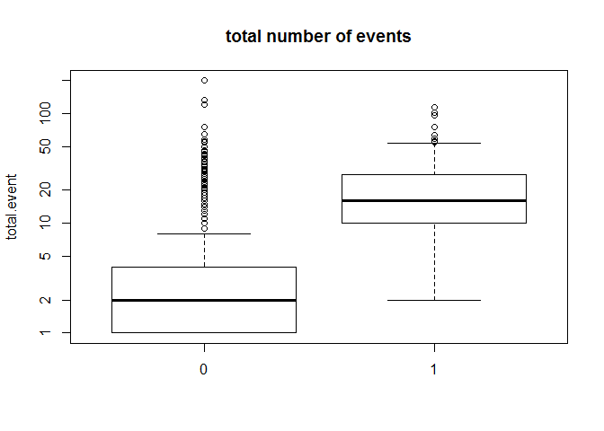

    # event number of converted users. Converted users have more events
    tapply(df$total.event, df$converted, summary)

    ## $`0`
    ##    Min. 1st Qu.  Median    Mean 3rd Qu.    Max. 
    ##   1.000   1.000   2.000   3.898   4.000 198.000 
    ## 
    ## $`1`
    ##    Min. 1st Qu.  Median    Mean 3rd Qu.    Max. 
    ##    2.00   10.00   16.00   20.45   27.50  113.00

    tapply(df$total.event, df$converted, table)

    ## $`0`
    ## 
    ##    1    2    3    4    5    6    7    8    9   10   11   12   13   14   15 
    ## 1814 2035  509  459  253  183  148  142   91   85   79   64   50   34   31 
    ##   16   17   18   19   20   21   22   23   24   25   26   27   28   29   30 
    ##   40   22   19   12   16   12   17   10    8    4   10    4    5    6    2 
    ##   31   33   34   36   37   38   39   41   42   43   45   46   50   54   55 
    ##    4    3    5    2    1    1    2    1    2    1    1    1    1    1    1 
    ##   58   65   75  119  133  198 
    ##    1    1    1    1    1    1 
    ## 
    ## $`1`
    ## 
    ##   2   3   4   5   6   7   8   9  10  11  12  13  14  15  16  17  18  19 
    ##   1   3   3  25   7   7   8   9  10  10  11  11   9   7   7   7  11   7 
    ##  20  21  22  23  24  25  26  27  28  29  30  31  32  33  34  35  36  37 
    ##  13   7   5   2   2   3   3   3   8   4   5   1   3   3   4   3   1   3 
    ##  38  39  41  42  44  45  46  48  51  53  54  55  56  59  63  75  95 101 
    ##   2   2   2   4   3   1   1   1   1   2   1   1   1   1   1   1   1   1 
    ## 102 113 
    ##   1   1

    plot(density(df[df$converted==1,]$total.event), main = "Converted users")

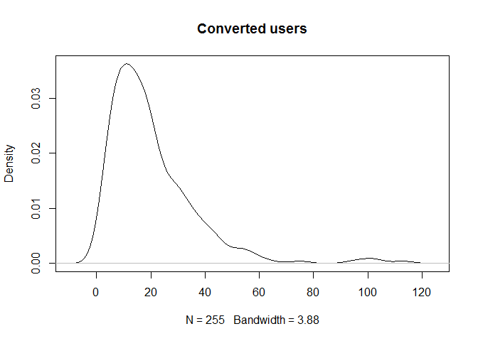

    plot(density(df[df$converted==0,]$total.event), main = "Non-converted users")

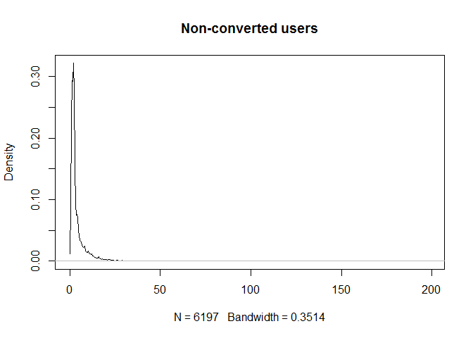

### 3. Time span

    # time span
    boxplot((as.numeric(time.span)+1) ~ converted, df, log = "y", main = "user time span")

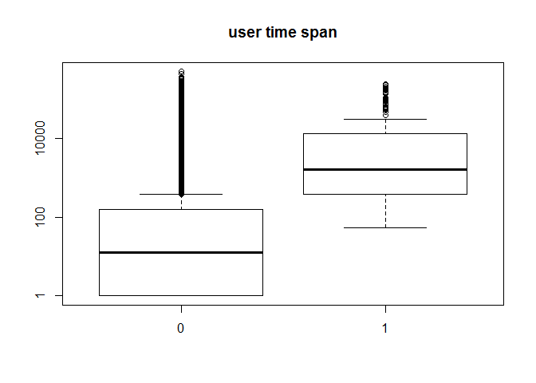

    # average time span per event
    boxplot((as.numeric(time.span)+1)/total.event ~ converted, df, log = "y", main = "average time span per event")

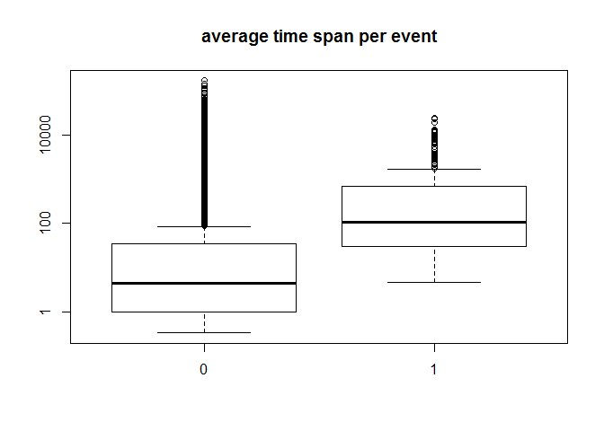

### 4. Device

    # what device do they use 
    table(df$properties..os, df$converted)

    ##          
    ##              0    1
    ##   Android  720    7
    ##   iOS      714    2
    ##   linux     37    0
    ##   macosx   862   48
    ##   na         9    0
    ##   windows 3855  198

### 5. Screen size

    # screen size vs convertion: bigger screen seems correlated with higher conversion
    table(df$properties..screen_height, df$converted)

    ##       
    ##           0    1
    ##   360     3    0
    ##   480     2    0
    ##   495     1    0
    ##   511     6    0
    ##   534     1    0
    ##   540     1    1
    ##   563     1    0
    ##   568    85    0
    ##   570    13    0
    ##   591     1    0
    ##   592    17    0
    ##   596     1    0
    ##   598    18    0
    ##   600    16    0
    ##   602     7    0
    ##   604    56    0
    ##   614     7    0
    ##   616     1    0
    ##   617     1    0
    ##   618     1    0
    ##   640   446    4
    ##   655     2    0
    ##   663     5    0
    ##   667   307    1
    ##   686     1    0
    ##   694     1    0
    ##   696     3    0
    ##   697     1    0
    ##   698     5    0
    ##   699    15    1
    ##   700     1    0
    ##   720   124    5
    ##   728     1    0
    ##   730     1    1
    ##   731     9    0
    ##   732    34    1
    ##   736   159    0
    ##   737     2    0
    ##   745     2    0
    ##   768  1859   78
    ##   771     1    0
    ##   783     1    0
    ##   800   368   18
    ##   808     1    0
    ##   818     1    0
    ##   822     1    0
    ##   823     1    0
    ##   831     1    0
    ##   847     1    0
    ##   853     2    0
    ##   854     6    0
    ##   857     2    0
    ##   864   116    5
    ##   889     1    0
    ##   900   846   50
    ##   912    14    1
    ##   915     1    0
    ##   923     1    0
    ##   939     2    0
    ##   943     2    0
    ##   947     1    0
    ##   960    15    1
    ##   982     1    0
    ##   983     1    0
    ##   1000    5    0
    ##   1020    3    0
    ##   1024   81    4
    ##   1028    1    0
    ##   1029    3    0
    ##   1032    1    0
    ##   1050   86    4
    ##   1067    2    0
    ##   1080 1203   66
    ##   1091    1    0
    ##   1127    1    0
    ##   1137    1    0
    ##   1152   16    2
    ##   1165    2    0
    ##   1184    3    0
    ##   1200   53    7
    ##   1208    1    0
    ##   1280   11    0
    ##   1357    1    0
    ##   1440   49    5
    ##   1600   17    0
    ##   1776   10    0
    ##   1788    1    0
    ##   1794    5    0
    ##   1800    3    0
    ##   1812   17    0
    ##   1821    2    0
    ##   1830    1    0
    ##   1848    1    0
    ##   1920    9    0
    ##   2215    1    0
    ##   2560    2    0

    table(df$properties..screen_width, df$converted)

    ##       
    ##           0    1
    ##   320   101    0
    ##   360   556    4
    ##   375   307    1
    ##   384     6    0
    ##   393    22    1
    ##   412    36    1
    ##   414   159    0
    ##   432     5    1
    ##   480     9    0
    ##   540     1    0
    ##   640     3    0
    ##   720    15    0
    ##   768    26    0
    ##   800     3    0
    ##   881     1    0
    ##   960     1    1
    ##   1002    1    0
    ##   1024  456    1
    ##   1051    1    0
    ##   1067    1    0
    ##   1080   50    0
    ##   1088    1    0
    ##   1093    6    0
    ##   1097    2    0
    ##   1098    1    0
    ##   1120    1    0
    ##   1138    1    0
    ##   1152    9    0
    ##   1239    1    0
    ##   1242    4    0
    ##   1271    1    0
    ##   1280  544   27
    ##   1301    9    0
    ##   1309    1    0
    ##   1311    2    0
    ##   1324    2    0
    ##   1333    1    0
    ##   1360   37    4
    ##   1362    1    0
    ##   1364    1    0
    ##   1366 1363   73
    ##   1368   14    1
    ##   1371    2    0
    ##   1391    1    0
    ##   1400    2    0
    ##   1422    2    0
    ##   1423    1    0
    ##   1438    1    0
    ##   1440  608   41
    ##   1462    1    0
    ##   1463    2    0
    ##   1477    2    0
    ##   1500    4    0
    ##   1518    2    0
    ##   1524    1    0
    ##   1536  114    6
    ##   1600  268    9
    ##   1645    1    0
    ##   1652    1    0
    ##   1670    2    0
    ##   1676    2    0
    ##   1680   84    4
    ##   1684    1    0
    ##   1707    2    0
    ##   1745    2    0
    ##   1778    1    0
    ##   1829    3    0
    ##   1830    1    0
    ##   1864    2    0
    ##   1920 1245   72
    ##   2003    1    0
    ##   2021    1    0
    ##   2048   15    2
    ##   2049    1    0
    ##   2133    3    1
    ##   2160    1    0
    ##   2495    1    0
    ##   2560   51    5
    ##   3323    1    0
    ##   3440    2    0

### 6. Browser

    table(df$properties..browser, df$converted)

    ##                 
    ##                     0    1
    ##   360               8    0
    ##   ali-ap            1    0
    ##   android          15    0
    ##   baidu            35    0
    ##   chrome         3294  172
    ##   coolnovo          1    0
    ##   edge            130    5
    ##   firefox         317   21
    ##   ie              352    4
    ##   liebao            9    0
    ##   maxthon          25    1
    ##   mi               46    1
    ##   micromessenger  248    1
    ##   na               43    0
    ##   opera             8    1
    ##   qq              364   15
    ##   safari          681   16
    ##   sogou           250   15
    ##   theworld         17    1
    ##   tt                6    0
    ##   uc              216    2
    ##   webview         128    0
    ##   yandex            3    0

### 7. Page stay time

    # page stay time
    page.stay.time.feature <- c("totalPageStayTime_index", "totalPageStayTime_about", "totalPageStayTime_demo", "totalPageStayTime_courses", "totalPageStayTime_courses_play", "totalPageStayTime_page_close")

    for (i in 1:length(page.stay.time.feature)){
      feature <- page.stay.time.feature[i]
      print(feature)
      print(tapply(df[,feature], df$converted, summary))
    }

    ## [1] "totalPageStayTime_index"
    ## $`0`
    ##     Min.  1st Qu.   Median     Mean  3rd Qu.     Max. 
    ##      0.0      0.0      5.3   1223.0     30.5 481000.0 
    ## 
    ## $`1`
    ##      Min.   1st Qu.    Median      Mean   3rd Qu.      Max. 
    ##      0.00     92.08    256.80   3516.00   1142.00 143100.00 
    ## 
    ## [1] "totalPageStayTime_about"
    ## $`0`
    ##     Min.  1st Qu.   Median     Mean  3rd Qu.     Max. 
    ##      0.0      0.0      0.0    147.9      0.0 256100.0 
    ## 
    ## $`1`
    ##    Min. 1st Qu.  Median    Mean 3rd Qu.    Max. 
    ##     0.0     0.0     0.0   268.7     0.0 56040.0 
    ## 
    ## [1] "totalPageStayTime_demo"
    ## $`0`
    ##     Min.  1st Qu.   Median     Mean  3rd Qu.     Max. 
    ##      0.0      0.0      0.0    685.5      0.0 373400.0 
    ## 
    ## $`1`
    ##     Min.  1st Qu.   Median     Mean  3rd Qu.     Max. 
    ##      0.0     90.3    427.4  10000.0   2688.0 561700.0 
    ## 
    ## [1] "totalPageStayTime_courses"
    ## $`0`
    ##     Min.  1st Qu.   Median     Mean  3rd Qu.     Max. 
    ##      0.0      0.0      0.0    216.1      0.0 224700.0 
    ## 
    ## $`1`
    ##    Min. 1st Qu.  Median    Mean 3rd Qu.    Max. 
    ##       0       0       0    1153       0  225400 
    ## 
    ## [1] "totalPageStayTime_courses_play"
    ## $`0`
    ##      Min.   1st Qu.    Median      Mean   3rd Qu.      Max. 
    ##      0.00      0.00      0.00     70.41      0.00 131500.00 
    ## 
    ## $`1`
    ##     Min.  1st Qu.   Median     Mean  3rd Qu.     Max. 
    ##      0.0      0.0      0.0    806.9      0.0 184000.0 
    ## 
    ## [1] "totalPageStayTime_page_close"
    ## $`0`
    ##      Min.   1st Qu.    Median      Mean   3rd Qu.      Max. 
    ##      0.00      0.00      0.00     79.98      0.00 270100.00 
    ## 
    ## $`1`
    ##    Min. 1st Qu.  Median    Mean 3rd Qu.    Max. 
    ##    0.00    0.00    0.00   21.67    0.00 5498.00

### Convert categorical features into dummy variables

    model.df <- dummy.data.frame(df)

    colnames(model.df) <- gsub("-", "_", colnames(model.df))

    dim(model.df)

    ## [1] 6452  323

    colnames(model.df)

    ##   [1] "time.span"                                                  
    ##   [2] "pageview"                                                   
    ##   [3] "about_leave"                                                
    ##   [4] "btnClick"                                                   
    ##   [5] "courses_leave"                                              
    ##   [6] "courses_play_leave"                                         
    ##   [7] "demo_leave"                                                 
    ##   [8] "index_leave"                                                
    ##   [9] "page_close"                                                 
    ##  [10] "total.event"                                                
    ##  [11] "properties..osAndroid"                                      
    ##  [12] "properties..osiOS"                                          
    ##  [13] "properties..oslinux"                                        
    ##  [14] "properties..osmacosx"                                       
    ##  [15] "properties..osna"                                           
    ##  [16] "properties..oswindows"                                      
    ##  [17] "properties..modelandroid"                                   
    ##  [18] "properties..modelcoolpad"                                   
    ##  [19] "properties..modelhongmi"                                    
    ##  [20] "properties..modelhtc"                                       
    ##  [21] "properties..modelhuawei"                                    
    ##  [22] "properties..modelipad"                                      
    ##  [23] "properties..modeliphone"                                    
    ##  [24] "properties..modellenovo"                                    
    ##  [25] "properties..modellg"                                        
    ##  [26] "properties..modelmac"                                       
    ##  [27] "properties..modelmeizu"                                     
    ##  [28] "properties..modelmi"                                        
    ##  [29] "properties..modelna"                                        
    ##  [30] "properties..modelnexus"                                     
    ##  [31] "properties..modeloppo"                                      
    ##  [32] "properties..modelpc"                                        
    ##  [33] "properties..modelsamsung"                                   
    ##  [34] "properties..modelvivo"                                      
    ##  [35] "properties..modelzte"                                       
    ##  [36] "properties..screen_height"                                  
    ##  [37] "properties..screen_width"                                   
    ##  [38] "properties..browser360"                                     
    ##  [39] "properties..browserali_ap"                                  
    ##  [40] "properties..browserandroid"                                 
    ##  [41] "properties..browserbaidu"                                   
    ##  [42] "properties..browserchrome"                                  
    ##  [43] "properties..browsercoolnovo"                                
    ##  [44] "properties..browseredge"                                    
    ##  [45] "properties..browserfirefox"                                 
    ##  [46] "properties..browserie"                                      
    ##  [47] "properties..browserliebao"                                  
    ##  [48] "properties..browsermaxthon"                                 
    ##  [49] "properties..browsermi"                                      
    ##  [50] "properties..browsermicromessenger"                          
    ##  [51] "properties..browserna"                                      
    ##  [52] "properties..browseropera"                                   
    ##  [53] "properties..browserqq"                                      
    ##  [54] "properties..browsersafari"                                  
    ##  [55] "properties..browsersogou"                                   
    ##  [56] "properties..browsertheworld"                                
    ##  [57] "properties..browsertt"                                      
    ##  [58] "properties..browseruc"                                      
    ##  [59] "properties..browserwebview"                                 
    ##  [60] "properties..browseryandex"                                  
    ##  [61] "properties..latest_referrer_host"                           
    ##  [62] "properties..latest_referrer_host10.10.16.14"                
    ##  [63] "properties..latest_referrer_host10.2.79.161"                
    ##  [64] "properties..latest_referrer_host10.201.48.21"               
    ##  [65] "properties..latest_referrer_host10.44.140.156"              
    ##  [66] "properties..latest_referrer_host106.185.42.123"             
    ##  [67] "properties..latest_referrer_host106.75.134.247"             
    ##  [68] "properties..latest_referrer_host112.124.212.243"            
    ##  [69] "properties..latest_referrer_host116.62.89.9"                
    ##  [70] "properties..latest_referrer_host118.178.19.175"             
    ##  [71] "properties..latest_referrer_host120.25.99.90"               
    ##  [72] "properties..latest_referrer_host124.243.216.219"            
    ##  [73] "properties..latest_referrer_host127.0.0.1"                  
    ##  [74] "properties..latest_referrer_host168.63.205.22"              
    ##  [75] "properties..latest_referrer_host192.168.1.254"              
    ##  [76] "properties..latest_referrer_host192.168.229.26"             
    ##  [77] "properties..latest_referrer_host36kr.com"                   
    ##  [78] "properties..latest_referrer_host47.93.78.66"                
    ##  [79] "properties..latest_referrer_hosta.mobi.sogou.com"           
    ##  [80] "properties..latest_referrer_hosta.youdao.com"               
    ##  [81] "properties..latest_referrer_hostanalytics.51credit.com"     
    ##  [82] "properties..latest_referrer_hostba_demo.tingyun.com"        
    ##  [83] "properties..latest_referrer_hostblog.csdn.net"              
    ##  [84] "properties..latest_referrer_hostblog.sanjieke.cn"           
    ##  [85] "properties..latest_referrer_hostc.tieba.baidu.com"          
    ##  [86] "properties..latest_referrer_hostchuang.36kr.com"            
    ##  [87] "properties..latest_referrer_hostclass.sanjieke.cn"          
    ##  [88] "properties..latest_referrer_hostcn.bing.com"                
    ##  [89] "properties..latest_referrer_hostconfluence.bbtree.com"      
    ##  [90] "properties..latest_referrer_hostcpro.baidu.com"             
    ##  [91] "properties..latest_referrer_hostdata.corp.36kr.com"         
    ##  [92] "properties..latest_referrer_hostdata.gotokeep.com"          
    ##  [93] "properties..latest_referrer_hostdata.jyw.xy.com"            
    ##  [94] "properties..latest_referrer_hostdata.kikuu.com"             
    ##  [95] "properties..latest_referrer_hostdata.systoon.com"           
    ##  [96] "properties..latest_referrer_hostdata.wxrrd.com"             
    ##  [97] "properties..latest_referrer_hostdatadang.com"               
    ##  [98] "properties..latest_referrer_hostdss.innotree.cn"            
    ##  [99] "properties..latest_referrer_hostduckduckgo.com"             
    ## [100] "properties..latest_referrer_hostgoogleads.g.doubleclick.net"
    ## [101] "properties..latest_referrer_hosthao.199it.com"              
    ## [102] "properties..latest_referrer_hosthao.2b.cn"                  
    ## [103] "properties..latest_referrer_hosthippter.com"                
    ## [104] "properties..latest_referrer_hosthr.36kr.com"                
    ## [105] "properties..latest_referrer_hosthuaban.com"                 
    ## [106] "properties..latest_referrer_hostimage.baidu.com"            
    ## [107] "properties..latest_referrer_hostipv6.google.com.hk"         
    ## [108] "properties..latest_referrer_hostlink.zhihu.com"             
    ## [109] "properties..latest_referrer_hostlnkd.in"                    
    ## [110] "properties..latest_referrer_hostm.baidu.com"                
    ## [111] "properties..latest_referrer_hostm.sogou.com"                
    ## [112] "properties..latest_referrer_hostm5.baidu.com"               
    ## [113] "properties..latest_referrer_hostmail.qq.com"                
    ## [114] "properties..latest_referrer_hostmp.weixinbridge.com"        
    ## [115] "properties..latest_referrer_hostnewseed.pedaily.cn"         
    ## [116] "properties..latest_referrer_hostnext.36kr.com"              
    ## [117] "properties..latest_referrer_hostnot_avaiable"               
    ## [118] "properties..latest_referrer_hostopen.ezrpro.com"            
    ## [119] "properties..latest_referrer_hostpassport.36kr.com"          
    ## [120] "properties..latest_referrer_hostpintu.corp.36kr.com"        
    ## [121] "properties..latest_referrer_hostqimingpian.com"             
    ## [122] "properties..latest_referrer_hostrong.36kr.com"              
    ## [123] "properties..latest_referrer_hostsas.foneshare.cn"           
    ## [124] "properties..latest_referrer_hostsaweb.quickcan.com"         
    ## [125] "properties..latest_referrer_hostsawiki2.nie.netease.com"    
    ## [126] "properties..latest_referrer_hostsc.ppmoney.com"             
    ## [127] "properties..latest_referrer_hostsc.vipkid.com.cn"           
    ## [128] "properties..latest_referrer_hostsc.zhugefang.com"           
    ## [129] "properties..latest_referrer_hostsd.int.jumei.com"           
    ## [130] "properties..latest_referrer_hostsegmentfault.com"           
    ## [131] "properties..latest_referrer_hostsensors.100.me"             
    ## [132] "properties..latest_referrer_hostsensors.fqgj.net"           
    ## [133] "properties..latest_referrer_hostsensors.ishansong.com"      
    ## [134] "properties..latest_referrer_hostsensors.jiedaibao.com"      
    ## [135] "properties..latest_referrer_hostsensors.mu77.com"           
    ## [136] "properties..latest_referrer_hostsensors.ymt360.com"         
    ## [137] "properties..latest_referrer_hostsensorsdata.vipkid.com.cn"  
    ## [138] "properties..latest_referrer_hostshence.tiebaobei.com"       
    ## [139] "properties..latest_referrer_hostshimo.im"                   
    ## [140] "properties..latest_referrer_hostshouce.kuchuan.com"         
    ## [141] "properties..latest_referrer_hostso.m.sm.cn"                 
    ## [142] "properties..latest_referrer_hoststat_sc.formaxoa.com"       
    ## [143] "properties..latest_referrer_hosttieba.baidu.com"            
    ## [144] "properties..latest_referrer_hosttongji.yeshen.com"          
    ## [145] "properties..latest_referrer_hostts2.m.sm.cn"                
    ## [146] "properties..latest_referrer_hostuc.36kr.com"                
    ## [147] "properties..latest_referrer_hostuxren.cn"                   
    ## [148] "properties..latest_referrer_hostview.yiqioffice.com"        
    ## [149] "properties..latest_referrer_hostwap.sogou.com"              
    ## [150] "properties..latest_referrer_hostwapbaike.baidu.com"         
    ## [151] "properties..latest_referrer_hostwenku.baidu.com"            
    ## [152] "properties..latest_referrer_hostwiki.sankuai.com"           
    ## [153] "properties..latest_referrer_hostwisd.sogou.com"             
    ## [154] "properties..latest_referrer_hostwww.199it.com"              
    ## [155] "properties..latest_referrer_hostwww.3lian.com"              
    ## [156] "properties..latest_referrer_hostwww.appganhuo.com"          
    ## [157] "properties..latest_referrer_hostwww.baidu.com"              
    ## [158] "properties..latest_referrer_hostwww.bing.com"               
    ## [159] "properties..latest_referrer_hostwww.daxiangrenshi.com"      
    ## [160] "properties..latest_referrer_hostwww.digitaling.com"         
    ## [161] "properties..latest_referrer_hostwww.ecdaohang.cn"           
    ## [162] "properties..latest_referrer_hostwww.finger66.com"           
    ## [163] "properties..latest_referrer_hostwww.google.co.jp"           
    ## [164] "properties..latest_referrer_hostwww.google.co.kr"           
    ## [165] "properties..latest_referrer_hostwww.google.co.uk"           
    ## [166] "properties..latest_referrer_hostwww.google.co.zm"           
    ## [167] "properties..latest_referrer_hostwww.google.com"             
    ## [168] "properties..latest_referrer_hostwww.google.com.au"          
    ## [169] "properties..latest_referrer_hostwww.google.com.hk"          
    ## [170] "properties..latest_referrer_hostwww.google.com.ph"          
    ## [171] "properties..latest_referrer_hostwww.google.com.tw"          
    ## [172] "properties..latest_referrer_hostwww.google.com.vn"          
    ## [173] "properties..latest_referrer_hostwww.google.fr"              
    ## [174] "properties..latest_referrer_hostwww.google.nl"              
    ## [175] "properties..latest_referrer_hostwww.hippter.com"            
    ## [176] "properties..latest_referrer_hostwww.imgeek.org"             
    ## [177] "properties..latest_referrer_hostwww.itjuzi.com"             
    ## [178] "properties..latest_referrer_hostwww.jianshu.com"            
    ## [179] "properties..latest_referrer_hostwww.jiuzhilan.com"          
    ## [180] "properties..latest_referrer_hostwww.linear.vc"              
    ## [181] "properties..latest_referrer_hostwww.mulumu.com"             
    ## [182] "properties..latest_referrer_hostwww.oneapm.com"             
    ## [183] "properties..latest_referrer_hostwww.prnasia.com"            
    ## [184] "properties..latest_referrer_hostwww.qixin.com"              
    ## [185] "properties..latest_referrer_hostwww.rinterest.cn"           
    ## [186] "properties..latest_referrer_hostwww.sanjieke.cn"            
    ## [187] "properties..latest_referrer_hostwww.sdk.cn"                 
    ## [188] "properties..latest_referrer_hostwww.so.com"                 
    ## [189] "properties..latest_referrer_hostwww.sogou.com"              
    ## [190] "properties..latest_referrer_hostwww.tianyancha.com"         
    ## [191] "properties..latest_referrer_hostwww.tisiwi.com"             
    ## [192] "properties..latest_referrer_hostwww.tongdao.io"             
    ## [193] "properties..latest_referrer_hostwww.woshipm.com"            
    ## [194] "properties..latest_referrer_hostwww.wukongdata.com"         
    ## [195] "properties..latest_referrer_hostwww.xfz.cn"                 
    ## [196] "properties..latest_referrer_hostyandex.ru"                  
    ## [197] "properties..latest_referrer_hostyouxuan.baidu.com"          
    ## [198] "properties..latest_referrer_hostysdss.tking.cn"             
    ## [199] "properties..latest_referrer_hostzhidao.baidu.com"           
    ## [200] "properties..latest_referrer_hostzhishi.sogou.com"           
    ## [201] "url_path."                                                  
    ## [202] "url_path.about.html"                                        
    ## [203] "url_path.b_round.html"                                      
    ## [204] "url_path.courses."                                          
    ## [205] "url_path.courses.index.html"                                
    ## [206] "url_path.courses.play.html"                                 
    ## [207] "url_path.demo.html"                                         
    ## [208] "url_path.index.html"                                        
    ## [209] "url_path.manual."                                           
    ## [210] "url_path.manual.about.html"                                 
    ## [211] "url_path.manual.access_control.html"                        
    ## [212] "url_path.manual.access_control_tool.html"                   
    ## [213] "url_path.manual.addiction.html"                             
    ## [214] "url_path.manual.android_sdk.html"                           
    ## [215] "url_path.manual.android_sdk_autotrack.html"                 
    ## [216] "url_path.manual.api.html"                                   
    ## [217] "url_path.manual.apicloud_sdk.html"                          
    ## [218] "url_path.manual.app_channel_tracking.html"                  
    ## [219] "url_path.manual.app_h5.html"                                
    ## [220] "url_path.manual.app_push.html"                              
    ## [221] "url_path.manual.b2b_homepage_case.html"                     
    ## [222] "url_path.manual.b2b_homepage_case_core_measure.html"        
    ## [223] "url_path.manual.b2b_homepage_case_data_feed.html"           
    ## [224] "url_path.manual.batch_importer.html"                        
    ## [225] "url_path.manual.bookmark_dashboard.html"                    
    ## [226] "url_path.manual.c_sdk.html"                                 
    ## [227] "url_path.manual.case.html"                                  
    ## [228] "url_path.manual.changelog.html"                             
    ## [229] "url_path.manual.config_basic_target.html"                   
    ## [230] "url_path.manual.custom_user_segmenter.html"                 
    ## [231] "url_path.manual.data_import.html"                           
    ## [232] "url_path.manual.data_import_api.html"                       
    ## [233] "url_path.manual.data_import_faq.html"                       
    ## [234] "url_path.manual.data_import_https.html"                     
    ## [235] "url_path.manual.data_import_kafka.html"                     
    ## [236] "url_path.manual.data_import_nginx.html"                     
    ## [237] "url_path.manual.data_import_rule.html"                      
    ## [238] "url_path.manual.data_management.html"                       
    ## [239] "url_path.manual.data_model.html"                            
    ## [240] "url_path.manual.data_schema.html"                           
    ## [241] "url_path.manual.data_stream.html"                           
    ## [242] "url_path.manual.debug_mode.html"                            
    ## [243] "url_path.manual.dimension_dict.html"                        
    ## [244] "url_path.manual.eb_case.html"                               
    ## [245] "url_path.manual.eb_case_core_measure.html"                  
    ## [246] "url_path.manual.eb_case_data_feed.html"                     
    ## [247] "url_path.manual.edu_case.html"                              
    ## [248] "url_path.manual.edu_case_core_measure.html"                 
    ## [249] "url_path.manual.edu_case_data_feed.html"                    
    ## [250] "url_path.manual.event_ana.html"                             
    ## [251] "url_path.manual.ext_processor.html"                         
    ## [252] "url_path.manual.faq.html"                                   
    ## [253] "url_path.manual.format_importer.html"                       
    ## [254] "url_path.manual.func_api.html"                              
    ## [255] "url_path.manual.funnel.html"                                
    ## [256] "url_path.manual.hdfs_importer.html"                         
    ## [257] "url_path.manual.import_tool.html"                           
    ## [258] "url_path.manual.index.html"                                 
    ## [259] "url_path.manual.ios_sdk.html"                               
    ## [260] "url_path.manual.ios_sdk_autotrack.html"                     
    ## [261] "url_path.manual.ios_sdk_faq.html"                           
    ## [262] "url_path.manual.java_sdk.html"                              
    ## [263] "url_path.manual.java_sdk_demo.html"                         
    ## [264] "url_path.manual.js_sdk.html"                                
    ## [265] "url_path.manual.js_sdk_demo.html"                           
    ## [266] "url_path.manual.kafka_consume.html"                         
    ## [267] "url_path.manual.mp_sdk.html"                                
    ## [268] "url_path.manual.multi_project.html"                         
    ## [269] "url_path.manual.node_sdk.html"                              
    ## [270] "url_path.manual.oauth_client.html"                          
    ## [271] "url_path.manual.other_tools.html"                           
    ## [272] "url_path.manual.php_sdk.html"                               
    ## [273] "url_path.manual.project_tools.html"                         
    ## [274] "url_path.manual.python_sdk.html"                            
    ## [275] "url_path.manual.query.html"                                 
    ## [276] "url_path.manual.query_api.html"                             
    ## [277] "url_path.manual.regex.html"                                 
    ## [278] "url_path.manual.retention.html"                             
    ## [279] "url_path.manual.sa_clean.html"                              
    ## [280] "url_path.manual.sa_share.html"                              
    ## [281] "url_path.manual.schema_tools.html"                          
    ## [282] "url_path.manual.sdk_manual.html"                            
    ## [283] "url_path.manual.sensors_analytics_term.html"                
    ## [284] "url_path.manual.time_on_page.html"                          
    ## [285] "url_path.manual.track_installation.html"                    
    ## [286] "url_path.manual.track_manager.html"                         
    ## [287] "url_path.manual.use_feature_video.html"                     
    ## [288] "url_path.manual.use_guide.html"                             
    ## [289] "url_path.manual.use_steps.html"                             
    ## [290] "url_path.manual.user_access_path_ana.html"                  
    ## [291] "url_path.manual.user_ana.html"                              
    ## [292] "url_path.manual.user_behavior.html"                         
    ## [293] "url_path.manual.user_identify.html"                         
    ## [294] "url_path.manual.user_segmentation.html"                     
    ## [295] "url_path.manual.user_sequence.html"                         
    ## [296] "url_path.manual.vtrack_intro.html"                          
    ## [297] "url_path.manual.web_analytics_term.html"                    
    ## [298] "url_path.manual.web_channel_tracking.html"                  
    ## [299] "url_path.product.html"                                      
    ## [300] "url_path.share.sa_recommend.html"                           
    ## [301] "url_path.share.share.html"                                  
    ## [302] "url_path.tools.code_auto."                                  
    ## [303] "url_path.tools.url_create.html"                             
    ## [304] "url_path.translate_c"                                       
    ## [305] "url_pathlocal_url"                                          
    ## [306] "total.btnClick"                                             
    ## [307] "btnClick.about"                                             
    ## [308] "btnClick.b_round"                                           
    ## [309] "btnClick.blog"                                              
    ## [310] "btnClick.demo"                                              
    ## [311] "btnClick.document"                                          
    ## [312] "btnClick.logo"                                              
    ## [313] "btnClick.mail"                                              
    ## [314] "btnClick.product"                                           
    ## [315] "btnClick.request"                                           
    ## [316] "btnClick.viedo"                                             
    ## [317] "totalPageStayTime_index"                                    
    ## [318] "totalPageStayTime_about"                                    
    ## [319] "totalPageStayTime_demo"                                     
    ## [320] "totalPageStayTime_courses"                                  
    ## [321] "totalPageStayTime_courses_play"                             
    ## [322] "totalPageStayTime_page_close"                               
    ## [323] "converted"

### Build predictive model to predict user conversion

#### Data split

    library(caTools) # for train test split
    library(ROSE) # for model measure stat

    ## Loaded ROSE 0.0-3

    library(rpart)

    # imbalanced class
    table(model.df$converted) 

    ## 
    ##    0    1 
    ## 6197  255

    # class 1 percentage: 0.03952263
    table(model.df$converted)[2]/dim(model.df)[1]

    ##          1 
    ## 0.03952263

    # train and test split
    set.seed(1)
    sample <- sample.split(model.df$converted, SplitRatio = 0.7)
    train <- model.df[sample,]
    test <- model.df[!sample,]

    # sanity check: make sure class ratio is similar in train and test data
    table(train$converted)[2]/dim(train)[1]

    ##          1 
    ## 0.03941541

    table(test$converted)[2]/dim(test)[1]

    ##          1 
    ## 0.03977273

    dim(train)

    ## [1] 4516  323

    dim(test)

    ## [1] 1936  323

#### Decision tree

    # build tree
    tree <- rpart(converted ~., data = train, method = "class")

    # feature importance
    barplot(tree$variable.importance[1:10], horiz = TRUE, angle = 45, axes = TRUE)

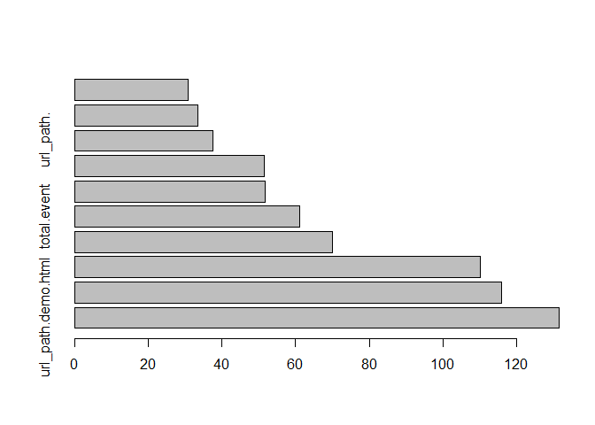

    plotcp(tree)

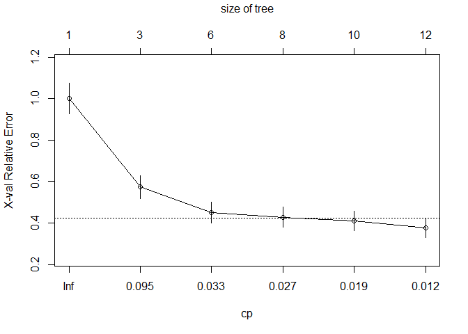

    printcp(tree)

    ## 
    ## Classification tree:
    ## rpart(formula = converted ~ ., data = train, method = "class")
    ## 
    ## Variables actually used in tree construction:
    ## [1] btnClick.demo           btnClick.request        time.span              
    ## [4] totalPageStayTime_demo  totalPageStayTime_index url_path.demo.html     
    ## 
    ## Root node error: 178/4516 = 0.039415
    ## 
    ## n= 4516 
    ## 
    ##         CP nsplit rel error  xerror     xstd
    ## 1 0.227528      0   1.00000 1.00000 0.073461
    ## 2 0.039326      2   0.54494 0.57303 0.056094
    ## 3 0.028090      5   0.39888 0.44944 0.049802
    ## 4 0.025281      7   0.34270 0.42697 0.048563
    ## 5 0.014045      9   0.29213 0.41011 0.047610
    ## 6 0.010000     11   0.26404 0.37640 0.045643

    # accuracy measures on test data
    accuracy.meas(test$converted, predict(tree, test)[,2])

    ## 
    ## Call: 
    ## accuracy.meas(response = test$converted, predicted = predict(tree, 
    ##     test)[, 2])
    ## 
    ## Examples are labelled as positive when predicted is greater than 0.5 
    ## 
    ## precision: 0.778
    ## recall: 0.818
    ## F: 0.399

    roc.curve(test$converted, predict(tree, test)[,2])

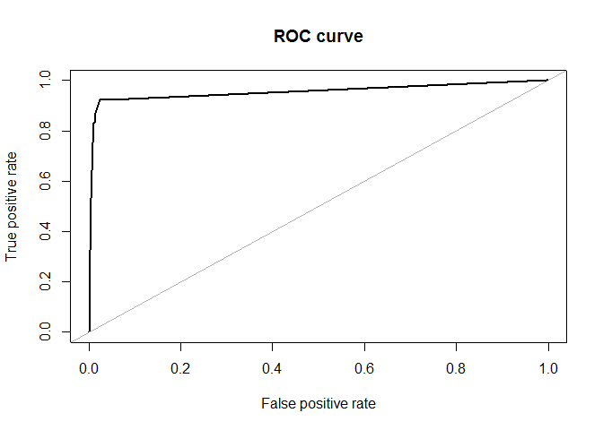

    ## Area under the curve (AUC): 0.954

#### Random forest

    library(randomForest)

    ## randomForest 4.6-12

    ## Type rfNews() to see new features/changes/bug fixes.

    ## 
    ## Attaching package: 'randomForest'

    ## The following object is masked from 'package:ggplot2':
    ## 
    ##     margin

    set.seed(1)
    rf <- randomForest(as.factor(converted) ~., data = train, importance = TRUE )
    print(rf)

    ## 
    ## Call:
    ##  randomForest(formula = as.factor(converted) ~ ., data = train,      importance = TRUE) 
    ##                Type of random forest: classification
    ##                      Number of trees: 500
    ## No. of variables tried at each split: 17
    ## 
    ##         OOB estimate of  error rate: 1.79%
    ## Confusion matrix:
    ##      0   1 class.error
    ## 0 4316  22 0.005071462
    ## 1   59 119 0.331460674

    varImpPlot(rf, n.var= 10)

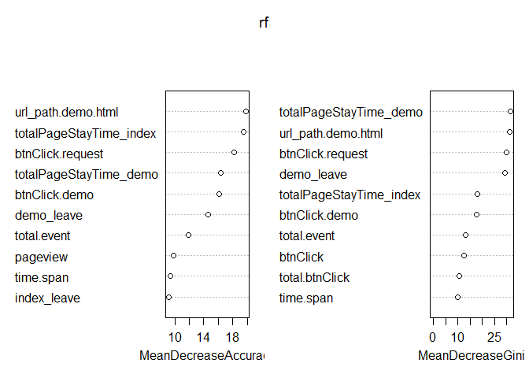

    # top 20 features 
    rf$importance[order(-rf$importance[,"MeanDecreaseAccuracy"]),][1:20,]

    ##                                                           0             1
    ## url_path.demo.html                             3.310634e-03  0.1452427332
    ## totalPageStayTime_demo                         2.119531e-03  0.1308095797
    ## demo_leave                                     2.938841e-03  0.0929781748
    ## btnClick.request                               5.796134e-05  0.1417320042
    ## totalPageStayTime_index                        8.380372e-04  0.0954996158
    ## btnClick.demo                                  3.198680e-03  0.0139487108
    ## total.event                                    1.487617e-03  0.0534088546
    ## total.btnClick                                 1.312603e-03  0.0385082512
    ## btnClick                                       1.112240e-03  0.0402089574
    ## pageview                                       9.821601e-04  0.0402057376
    ## time.span                                     -4.464262e-04  0.0547763253
    ## index_leave                                    1.200471e-03  0.0041674842
    ## url_path.                                      5.408557e-04  0.0049661805
    ## properties..latest_referrer_host               3.177185e-04  0.0060453686
    ## url_path.manual.                               4.879926e-04  0.0016330106
    ## properties..latest_referrer_hostwww.baidu.com  2.001403e-04  0.0077428021
    ## properties..screen_width                       3.204474e-04  0.0040666848
    ## url_path.product.html                          4.582998e-04 -0.0010641777
    ## btnClick.document                              3.846310e-04  0.0004972045
    ## url_path.manual.index.html                     1.900392e-04  0.0026539186
    ##                                               MeanDecreaseAccuracy
    ## url_path.demo.html                                    0.0089073592
    ## totalPageStayTime_demo                                0.0071502539
    ## demo_leave                                            0.0064660912
    ## btnClick.request                                      0.0056054559
    ## totalPageStayTime_index                               0.0045740064
    ## btnClick.demo                                         0.0036267935
    ## total.event                                           0.0035285771
    ## total.btnClick                                        0.0027680306
    ## btnClick                                              0.0026512469
    ## pageview                                              0.0025211181
    ## time.span                                             0.0017028366
    ## index_leave                                           0.0013131613
    ## url_path.                                             0.0007106143
    ## properties..latest_referrer_host                      0.0005402913
    ## url_path.manual.                                      0.0005277154
    ## properties..latest_referrer_hostwww.baidu.com         0.0004994826
    ## properties..screen_width                              0.0004689699
    ## url_path.product.html                                 0.0003961992
    ## btnClick.document                                     0.0003873071
    ## url_path.manual.index.html                            0.0002875333
    ##                                               MeanDecreaseGini
    ## url_path.demo.html                                   31.208474
    ## totalPageStayTime_demo                               31.709904
    ## demo_leave                                           29.414973
    ## btnClick.request                                     30.051432
    ## totalPageStayTime_index                              17.900235
    ## btnClick.demo                                        17.831924
    ## total.event                                          13.041976
    ## total.btnClick                                       10.728147
    ## btnClick                                             12.449366
    ## pageview                                              8.977404
    ## time.span                                            10.044696
    ## index_leave                                           4.864525
    ## url_path.                                             5.466556
    ## properties..latest_referrer_host                      2.387129
    ## url_path.manual.                                      2.743086
    ## properties..latest_referrer_hostwww.baidu.com         2.456188
    ## properties..screen_width                              3.153405
    ## url_path.product.html                                 2.678291
    ## btnClick.document                                     2.296085
    ## url_path.manual.index.html                            2.339036

    # model evaluation 
    accuracy.meas(test$converted, predict(rf, test, type = "prob")[,2])

    ## 
    ## Call: 
    ## accuracy.meas(response = test$converted, predicted = predict(rf, 
    ##     test, type = "prob")[, 2])
    ## 
    ## Examples are labelled as positive when predicted is greater than 0.5 
    ## 
    ## precision: 0.809
    ## recall: 0.714
    ## F: 0.379

    roc.curve(test$converted, predict(rf, test, type = "prob")[,2])

    ## Area under the curve (AUC): 0.993

    # tune random forest
    ntrees <- c(80, 100, 200)
    nodesize <- c(8, 10, 12)
    f.test <- NULL
    ntree.model <- NULL
    nodesize.model <- NULL
    for (i in ntrees){
      for (j in nodesize){
        set.seed(1)
        rf <- randomForest(as.factor(converted) ~., data = train, ntree = i, nodesize = j)
        f_score <- accuracy.meas(test$converted, predict(rf, test, type = "prob")[,2])$F
        f.test <- c(f.test, f_score)
        ntree.model <- c(ntree.model, i)
        nodesize.model <- c(nodesize.model, j)
      }
    }

    # best parameters
    rf.tune.res <- data.frame(ntree.model, nodesize.model, f.test)
    rf.tune.res

    ##   ntree.model nodesize.model    f.test
    ## 1          80              8 0.3767123
    ## 2          80             10 0.3724138
    ## 3          80             12 0.3706294
    ## 4         100              8 0.3680556
    ## 5         100             10 0.3835616
    ## 6         100             12 0.3750000
    ## 7         200              8 0.3750000
    ## 8         200             10 0.3819444
    ## 9         200             12 0.3750000

    rf.tune.res[which.max(rf.tune.res$f.test),]

    ##   ntree.model nodesize.model    f.test
    ## 5         100             10 0.3835616

    best.ntree <- rf.tune.res[which.max(rf.tune.res$f.test),]$ntree.model
    best.nodesize <- rf.tune.res[which.max(rf.tune.res$f.test),]$nodesize.model

    # evaluation
    set.seed(1)
    rf.best <- randomForest(as.factor(converted) ~., data = train, ntree = best.ntree, nodesize = best.nodesize)

    varImpPlot(rf.best, n.var= 10, cex = 1.1)

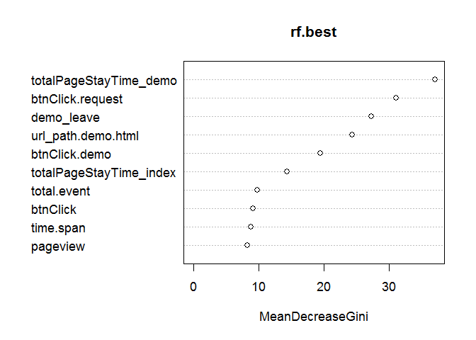

    accuracy.meas(test$converted, predict(rf.best, test, type = "prob")[,2])

    ## 
    ## Call: 
    ## accuracy.meas(response = test$converted, predicted = predict(rf.best, 
    ##     test, type = "prob")[, 2])
    ## 
    ## Examples are labelled as positive when predicted is greater than 0.5 
    ## 
    ## precision: 0.812
    ## recall: 0.727
    ## F: 0.384

    roc.curve(test$converted, predict(rf.best, test, type = "prob")[,2])

    ## Area under the curve (AUC): 0.993

#### Gradient boosting tree

    library(xgboost)

    train.matrix <- model.matrix(~., subset(train, select = - converted))
    train.y <- train$converted
    test.matrix <- model.matrix(~., subset(test, select = - converted))
    test.y <- test$converted

    set.seed(100)
    gbt <- xgboost(data = train.matrix, 
                   label = train.y, 
                   nrounds = 100,
                   objective = "binary:logistic",
                   early_stopping_rounds = 10,
                   verbose = 1)

    ## [1]  train-error:0.009300 
    ## Will train until train_error hasn't improved in 10 rounds.
    ## 
    ## [2]  train-error:0.008415 
    ## [3]  train-error:0.007307 
    ## [4]  train-error:0.006643 
    ## [5]  train-error:0.005979 
    ## [6]  train-error:0.005536 
    ## [7]  train-error:0.004650 
    ## [8]  train-error:0.004207 
    ## [9]  train-error:0.003986 
    ## [10] train-error:0.003764 
    ## [11] train-error:0.003100 
    ## [12] train-error:0.002214 
    ## [13] train-error:0.002436 
    ## [14] train-error:0.002214 
    ## [15] train-error:0.001993 
    ## [16] train-error:0.001993 
    ## [17] train-error:0.001550 
    ## [18] train-error:0.001550 
    ## [19] train-error:0.001550 
    ## [20] train-error:0.001329 
    ## [21] train-error:0.001107 
    ## [22] train-error:0.001107 
    ## [23] train-error:0.001107 
    ## [24] train-error:0.000886 
    ## [25] train-error:0.000886 
    ## [26] train-error:0.000664 
    ## [27] train-error:0.000664 
    ## [28] train-error:0.000664 
    ## [29] train-error:0.000664 
    ## [30] train-error:0.000664 
    ## [31] train-error:0.000886 
    ## [32] train-error:0.000664 
    ## [33] train-error:0.000664 
    ## [34] train-error:0.000664 
    ## [35] train-error:0.000443 
    ## [36] train-error:0.000443 
    ## [37] train-error:0.000443 
    ## [38] train-error:0.000443 
    ## [39] train-error:0.000443 
    ## [40] train-error:0.000443 
    ## [41] train-error:0.000443 
    ## [42] train-error:0.000443 
    ## [43] train-error:0.000443 
    ## [44] train-error:0.000443 
    ## [45] train-error:0.000443 
    ## Stopping. Best iteration:
    ## [35] train-error:0.000443

    # check importance of each feature
    importance <- xgb.importance(feature_names = colnames(train.matrix), model = gbt)
    head(importance, 20)

    ##                              Feature        Gain        Cover   Frequency
    ##  1:               url_path.demo.html 0.377731451 0.3383805901 0.097972973
    ##  2:                 btnClick.request 0.211850545 0.2721320045 0.096283784
    ##  3:          totalPageStayTime_index 0.109214672 0.0381888164 0.145270270
    ##  4:                    btnClick.demo 0.092438274 0.0213272804 0.052364865
    ##  5:           totalPageStayTime_demo 0.057791369 0.1478224173 0.089527027
    ##  6:                        time.span 0.030172006 0.0380573373 0.109797297
    ##  7:                         btnClick 0.018235724 0.0093438630 0.032094595
    ##  8:                 url_path.manual. 0.017469603 0.0076002672 0.021959459
    ##  9:        properties..screen_height 0.008148061 0.0059911060 0.040540541
    ## 10: properties..latest_referrer_host 0.006982737 0.0057040519 0.023648649
    ## 11:                        url_path. 0.006966263 0.0061208935 0.025337838
    ## 12:                btnClick.document 0.006606069 0.0009975474 0.005067568
    ## 13:            properties..oswindows 0.005884677 0.0042930663 0.016891892
    ## 14:         properties..screen_width 0.005411511 0.0052890450 0.032094595
    ## 15:                      total.event 0.004848023 0.0040122125 0.028716216
    ## 16:                       demo_leave 0.004615110 0.0046945193 0.016891892
    ## 17:                      index_leave 0.003991464 0.0039952405 0.016891892
    ## 18:                         pageview 0.003783937 0.0039092313 0.020270270
    ## 19:              url_path.about.html 0.003521893 0.0032147152 0.010135135
    ## 20:       properties..browserfirefox 0.002206445 0.0025803821 0.006756757

    xgb.plot.importance(importance_matrix = importance, top_n = 20, xlab = "feature importance", main = "Feature importance in xgboost model")

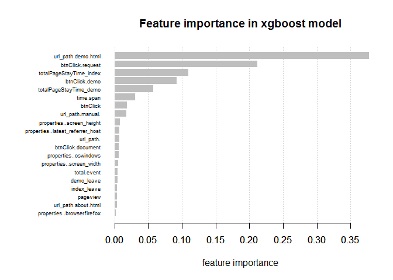

    # evaluation
    accuracy.meas(test.y, predict(gbt, test.matrix))

    ## 
    ## Call: 
    ## accuracy.meas(response = test.y, predicted = predict(gbt, test.matrix))
    ## 
    ## Examples are labelled as positive when predicted is greater than 0.5 
    ## 
    ## precision: 0.840
    ## recall: 0.883
    ## F: 0.430

    roc.curve(test.y, predict(gbt, test.matrix))

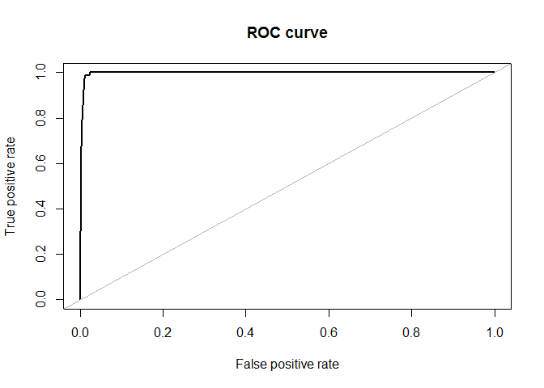

    ## Area under the curve (AUC): 0.997

    # tune xgboost
    max_depth <- c(4, 5, 6, 7)
    eta <- c(0.1, 0.2, 0.3, 0.4)
    max_depth.model <- NULL
    eta.model <- NULL
    test_auc <- NULL 
    xgb.res <- NULL

    for(depth in max_depth){
      for(e in eta){
            par <- list(objective = "binary:logistic", max_depth = depth, eta = e)
            set.seed(100)
            gbt.tune <- xgb.cv(params = par,
                               data = train.matrix,
                               label = train.y,
                               nfold = 10,
                               nrounds = 100,
                               early_stopping_rounds = 10,
                               metrics = "auc", #"error": binary classification error rate
                               verbose = 0)
            max_depth.model <- c(max_depth.model, depth)
            eta.model <- c(eta.model, e)
            auc <- min(gbt.tune$evaluation_log$test_auc_mean)
            test_auc <- c(test_auc, auc)
      }
    }

    xgb.tune.res <- data.frame(max_depth.model, eta.model, test_auc)
    xgb.tune.res

    ##    max_depth.model eta.model  test_auc
    ## 1                4       0.1 0.9555297
    ## 2                4       0.2 0.9555297
    ## 3                4       0.3 0.9555297
    ## 4                4       0.4 0.9555297
    ## 5                5       0.1 0.9566137
    ## 6                5       0.2 0.9566137
    ## 7                5       0.3 0.9566137
    ## 8                5       0.4 0.9566137
    ## 9                6       0.1 0.9566016
    ## 10               6       0.2 0.9566016
    ## 11               6       0.3 0.9566016
    ## 12               6       0.4 0.9566016
    ## 13               7       0.1 0.9562616
    ## 14               7       0.2 0.9562616
    ## 15               7       0.3 0.9562616
    ## 16               7       0.4 0.9562616

    xgb.tune.res[which.max(xgb.tune.res$test_auc),]

    ##   max_depth.model eta.model  test_auc
    ## 5               5       0.1 0.9566137

    best.eta <- xgb.tune.res[which.max(xgb.tune.res$test_auc),]$eta.model
    best.depth <- xgb.tune.res[which.max(xgb.tune.res$test_auc),]$max_depth.mode

    # use the best parameters to train xgboost
    set.seed(100)
    xgb.best <- xgboost(data = train.matrix, 
                   label = train.y, 
                   max_depth = best.depth,
                   eta = best.eta,
                   nround = 100,
                   objective = "binary:logistic",
                   early_stopping_rounds = 10,
                   verbose = 1)

    ## [1]  train-error:0.010407 
    ## Will train until train_error hasn't improved in 10 rounds.
    ## 
    ## [2]  train-error:0.010407 
    ## [3]  train-error:0.008857 
    ## [4]  train-error:0.008636 
    ## [5]  train-error:0.008636 
    ## [6]  train-error:0.008636 
    ## [7]  train-error:0.008415 
    ## [8]  train-error:0.008415 
    ## [9]  train-error:0.007750 
    ## [10] train-error:0.007529 
    ## [11] train-error:0.007086 
    ## [12] train-error:0.007086 
    ## [13] train-error:0.006864 
    ## [14] train-error:0.006643 
    ## [15] train-error:0.006643 
    ## [16] train-error:0.006643 
    ## [17] train-error:0.006643 
    ## [18] train-error:0.006864 
    ## [19] train-error:0.006422 
    ## [20] train-error:0.006422 
    ## [21] train-error:0.005979 
    ## [22] train-error:0.005757 
    ## [23] train-error:0.005757 
    ## [24] train-error:0.004872 
    ## [25] train-error:0.004650 
    ## [26] train-error:0.004650 
    ## [27] train-error:0.004872 
    ## [28] train-error:0.004429 
    ## [29] train-error:0.004207 
    ## [30] train-error:0.004429 
    ## [31] train-error:0.004429 
    ## [32] train-error:0.004429 
    ## [33] train-error:0.004429 
    ## [34] train-error:0.004429 
    ## [35] train-error:0.004207 
    ## [36] train-error:0.004207 
    ## [37] train-error:0.004207 
    ## [38] train-error:0.004207 
    ## [39] train-error:0.004207 
    ## Stopping. Best iteration:
    ## [29] train-error:0.004207

    # evaluation
    accuracy.meas(test.y, predict(xgb.best, test.matrix))

    ## 
    ## Call: 
    ## accuracy.meas(response = test.y, predicted = predict(xgb.best, 
    ##     test.matrix))
    ## 
    ## Examples are labelled as positive when predicted is greater than 0.5 
    ## 
    ## precision: 0.805
    ## recall: 0.857
    ## F: 0.415

    roc.curve(test.y, predict(xgb.best, test.matrix))

    ## Area under the curve (AUC): 0.996

#### Logistic Regression

    library(glmnet)

    ## Loading required package: Matrix

    ## 
    ## Attaching package: 'Matrix'

    ## The following object is masked from 'package:reshape':
    ## 
    ##     expand

    ## Loading required package: foreach

    ## Loaded glmnet 2.0-10

    # alpha = 1 is lasso regression. Helps to select features

    logistic.cv <- cv.glmnet(x = train.matrix,
                    y = train.y,
                    family = "binomial", 
                    alpha = 1,
                    standardize = TRUE)

    plot(logistic.cv) # lambda is the regularization strength  

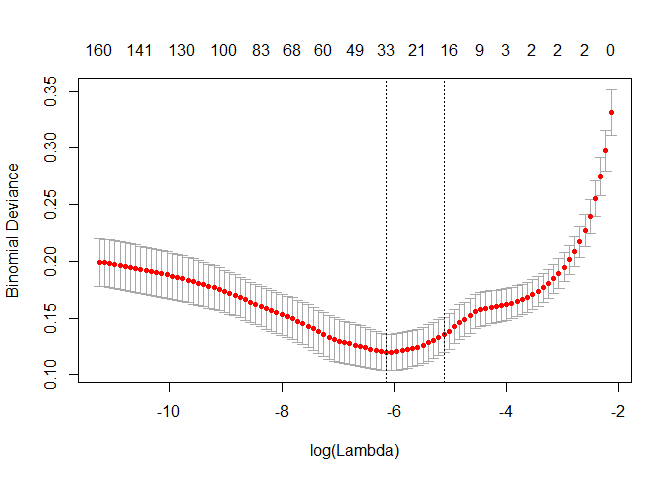

    logistic.cv$lambda.1se

    ## [1] 0.006000121

    coefs <- coef(logistic.cv, s = "lambda.1se")

    feature.imp <- data.frame(feature = dimnames(coefs)[[1]][which(coefs!=0)],
               coef = coefs[which(coefs!=0)])

    feature.imp <- feature.imp[order(-feature.imp$coef),]
    feature.imp

    ##                                          feature          coef
    ## 15            url_path.manual.user_sequence.html  2.0501062104
    ## 18                              btnClick.request  1.2462290503
    ## 10     url_path.manual.eb_case_core_measure.html  0.9880199958
    ## 9                   url_path.manual.eb_case.html  0.8159731576
    ## 11                 url_path.manual.edu_case.html  0.8001484944
    ## 7                             url_path.demo.html  0.6939135102
    ## 13             url_path.manual.schema_tools.html  0.6783670586
    ## 12                    url_path.manual.index.html  0.6059859663
    ## 2                                     demo_leave  0.3684887532
    ## 6  properties..latest_referrer_hostwww.baidu.com  0.2714817378
    ## 3                          properties..oswindows  0.2058159848
    ## 4                            properties..modelpc  0.0001048643
    ## 8                               url_path.manual. -0.1441113004
    ## 17                                 btnClick.logo -0.2580447635
    ## 5    properties..latest_referrer_hosthippter.com -0.2611325693
    ## 16                                 btnClick.demo -0.4037543473
    ## 14            url_path.manual.track_manager.html -1.4657762923
    ## 1                                    (Intercept) -5.1807975996

    barplot(feature.imp$coef, horiz = TRUE, main = "Feature coefficient", xlab = "coeffienct", ylab = "feature")

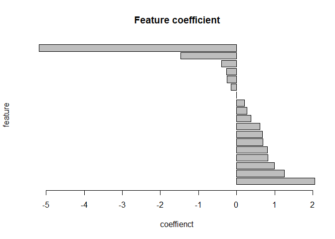

    # evaluation 
    accuracy.meas(test.y, predict(logistic.cv, test.matrix, s = "lambda.1se"))

    ## 
    ## Call: 
    ## accuracy.meas(response = test.y, predicted = predict(logistic.cv, 
    ##     test.matrix, s = "lambda.1se"))
    ## 
    ## Examples are labelled as positive when predicted is greater than 0.5 
    ## 
    ## precision: 0.778
    ## recall: 0.455
    ## F: 0.287

    roc.curve(test.y, predict(logistic.cv, test.matrix, s = "lambda.1se"))

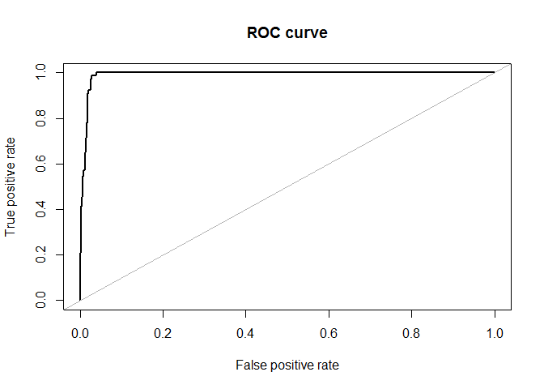

    ## Area under the curve (AUC): 0.991

#### In the above models, gradient boosting model give sthe best precision, recall, f1 score and AUC. Important features predicted from all these models are similar, including url\_path.demo.html, btnClick.request, totalPageStayTime\_index, ect. These features can be further investigated to improve website design and user signup rate.

#### Future work:

The AUC score is really high in all models. It is probably due to the
strong predictive information in the model. In real business modeling,
we want to make predictions before the users leave or sign up.
Therefore, we can use segments of data for a user in a certain period of
time. For example, predict user conversion after 24h of activity on the
website. From this information, we can advise the website to adjust
accordingly before losing a potential user.
